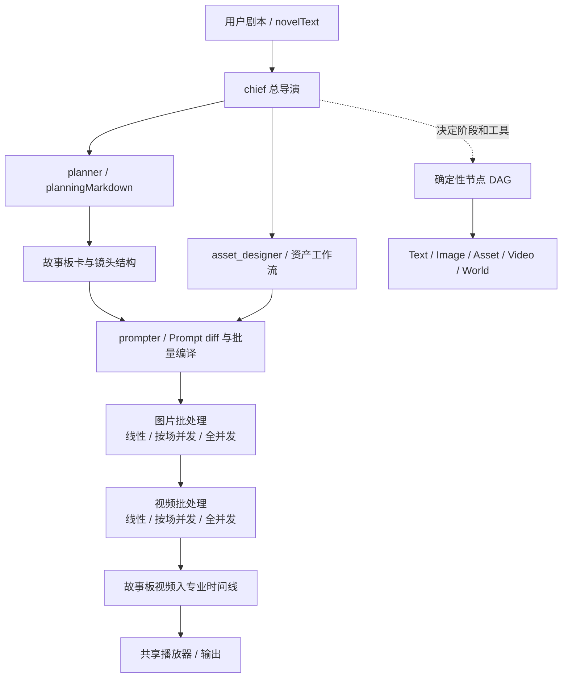

# Momo 与本地开源电影工作流编排审计（2026-07-21）

## 审计口径

本报告只记录本机源码可以证明的能力，不把截图、README 宣传或界面按钮当成执行证据。

- Momo 格式化 bundle：`/Users/zhangxiaohao/Ununu/电影工业控制/video-analysis/momo-source-2026-07-20/extracted/momo-flow-index-DZBEYAr3.js`
- Momo 既有分析：`/Users/zhangxiaohao/Ununu/电影工业控制/video-analysis/momo-source-2026-07-20/momo-source-interaction-and-agent-analysis-v0.1.md`
- 本地开源仓库：`/Users/zhangxiaohao/Ununu/external/`
- 既有分组源码审计：`external/_validation/five-layer-open-source-fusion/audits/group-{a,b,c,d}.md`

状态含义：`SOURCE_MAPPED` 表示已经从定义追到运行时调用；不等于在当前凭据和当前故事上完成真实付费验证。`UNVERIFIABLE` 表示当前 checkout 没有足够源码。

## 结论

这次《血月客栈》暴露的错误并不是“Prompt 写得不够长”，而是生产控制面少了一条强制的跨段状态传播门禁：上一段的实际 ACCEPT 尾态，没有成为下一段唯一、可验证的首帧权威；同时普通 Director/资产参考仍可能和 frame input 混进同一 Provider 请求。这样即便文字里写了入口、轴线和三符，模型仍可从大厅中央重新起步。

Momo、13 个本地开源项目都没有单独解决完整电影工业问题。正确组合是：

1. 采用 Momo 的“Agent 决策控制面 + 确定性节点 DAG + 可观察媒体批处理”三层编排。
2. 采用 ArcReel/LocalMiniDrama/Jellyfish/ViMax/Toonflow/deep-printfilm 的断点恢复、首尾帧、相邻镜状态和摄影机依赖经验。
3. 保留 Ununu 的事实、资产权威、空间导演台、GenerationUnit、付费门禁、CinematicEvaluationRecord、专业时间线和渲染交付；这些不能被 Momo 或任何单一开源仓库降级。
4. 连续镜头默认走“上一段 ACCEPT 尾帧 → 精确时间抽帧 → Core 来源校验 → 下一段 first frame”。普通身份/场景/Director 图仍可参与规划和审片，但当具体模型禁止混合输入时不得进入 Provider payload。

## Momo 的完整工作流与编排

### 1. Agent 决策控制面

Momo 的总导演不是直接调用一个“一键成片 Prompt”。bundle `17249–17268` 定义了可调用工具：项目进度、资产查看/编辑/新增/删除/生成/局部修改/连线、资产设计工作流、分块规划读取/保存/修改/首次生成、故事板读取/保存/修改、单条/批量 Prompt diff 和批量 Prompt 生成。

bundle `17270–17480` 还证明每个 session 独立持有消息、todo、tool-call state、`ask_user`、director handover 和持久化历史。既有四个 Agent 是：

| Agent | 职责 |
| --- | --- |
| `chief` | 理解用户目标、统筹和交接专业任务 |
| `planner` | 剧本分块、镜头结构和 planningMarkdown |
| `prompter` | 分镜 Prompt 编译与差量修改 |
| `asset_designer` | 角色、场景、道具等资产设计 |

bundle `32261–32284` 将 `isFullAuto` 持久化到 session；`32426–32440` 构造 `FlowAgentInput`，把 `autoRun`、`novelText`、`planningMarkdown`、`selectedSkill`、`styleConfig` 和当前模型一起传入 Agent。由此可确认的全自动含义是“同一套专业工具的自动推进模式”，不是另一套黑盒工作流。

### 2. planning 是稳定中间合同

Agent 层读取、保存和 diff 修改 `planningMarkdown`（bundle `32550` 之后）。它是下游继续解析的生产中间件，不能用聊天文字或一个长 textarea 代替。稳定的 clip/shot 标识负责局部重做、资产绑定、状态恢复和版本比较。

### 3. 确定性节点 DAG

bundle `19344–19515` 是与 Agent 层分开的节点执行器：

- 工作流状态：`idle/running/completed/failed/cancelled`；
- 节点状态：`pending/running/completed/skipped/failed/cancelled`；
- 从画布 edges 计算依赖和下游；
- 当前所有 ready 节点经 `Promise.allSettled` 并发；
- 完成后递减下游依赖计数；
- 任一节点失败终止后续 wave；
- `AbortController` 取消，同时取消运行中的真实任务；
- Text/Image/Asset/Video/World 可执行；Audio 在该执行器中作为资源节点跳过。

这证明 Momo 有两个不同层次：Agent 负责决定做什么，DAG 负责可复现地执行确定依赖。Ununu 的全自动生产也必须保持这种分层，不能让自然语言 Agent 直接改数据库或绕开用例。

### 4. 故事板图片批处理

bundle `30680–31035` 的图片工作流具备：

- 启动前检查主体资产是否缺少真实参考图，缺失时询问“强制继续/终止补图”；
- 跳过已有结果；
- 每卡最多 5 次重试；
- `fully_linear`、`scene_concurrent`、全部并发三种策略；
- 完全线性模式先生成第一镜并等待美术风格确认；
- 按场并发模式先生成各场首镜，逐场确认后再场内串行；
- 可跳过整场后续、终止、取消；
- tool card 持续显示 pending/loading/success/error/skip 和实际输出。

它的价值在于把“并发”限制在可以并发的场与卡上，同时保留风格审批点，而不是把整集所有图片盲目并发。

### 5. 故事板视频批处理

bundle `31100–31530` 的视频工作流与图片相似，但每卡最多 3 次重试；同样支持三种并发策略、首视频/每场首视频确认、跳过已有、失败明细、取消和下游 skip。它还会先检查引用是否满足当前视频模型输入形式。

Momo 这里仍主要做生成编排，没有源码证据证明它会校验 180° 轴线、入口站位、不可逆伤势、动作发起点、可数道具和跨镜实际尾态。因此 Ununu 的电影工业 QA 不能以“和 Momo 一致”为由删除。

### 6. 富 Prompt 与真实媒体 payload

Momo 使用 `promptJson`，其中 `referenceSlot`/`skillSlot` 是原子节点；UI 显示缩略图和资产名，提交时转换成 `@image_file_N`、`@audio_file_N`、`@video_file_N`，并同时发送真实媒体 URL 数组。`sourceNodeId` 使上游资产变化能够同步到引用。

故事板图片通过 `storyboard-image` 显式加入/移除（bundle `203715–203751`；初始化逻辑还见 `29875–29960`）。这只是可选视觉锚，不等于资产权威，更不应默认覆盖真实首帧连续性。

### 7. 故事板进入时间线

bundle `209217–209300` 从每卡 `clipsState[clip.id].videoInfo.video_url` 读取独立视频；后续 `batchAddStoryboardVideosToTimeline` 会：

- 打开底部时间线；
- 跳过已存在视频；
- 从相邻已有故事板片段推导插入索引；
- 顺序处理并显示 added/skipped/failed；
- 支持取消。

因此 Momo 的“分镜卡”既是生成单元也是时间线来源，但真正的剪辑顺序和媒体去重仍由确定性时间线处理。

### 8. Momo 编排图

## 13 个本地开源项目逐项对照

| 项目 | 源码证明的强项 | 不能证明/不应照搬 | Ununu 处理 |
| --- | --- | --- | --- |
| ArcReel | `/manga-workflow` 按已有文件检测当前阶段并从任意阶段恢复；图片/视频任务、provider 能力降级、lease worker、剪映/FFmpeg 输出完整；`lib/grid/prompt_builder.py:63–80` 有首尾帧链 | 导演字段仍偏景别/运镜枚举，缺世界坐标、轴线和实际尾态签核 | 吸收阶段恢复、提交/轮询/下载分级重试和 worker lease；保留 Ununu 镜头/空间合同 |
| LocalMiniDrama | `tailFrameLinkService.js:71–179` 从当前视频抽尾帧并写入下一分镜 `first_frame_image_id`；`framePromptService.js:91,279–343` 把 `layout_description` 设为空间/站位最高优先合同 | 文字“最高优先”仍不能证明模型遵守；尾帧若未验收会传播错误 | 已升级为 ACCEPT 媒体 + checksum + 精确抽帧 + 空间/主体/屏幕方向签核后才可续接 |
| Jellyfish | `shot_frame_prompt_agents.py:48–56` 和 `shot_frame_prompt_tasks.py:162–260` 分别编译首帧/尾帧/关键帧，并输入上一镜尾态、下一镜目标、构图锚和屏幕方向 | 没有完整最终时间线/混音/交付闭环 | 吸收相邻镜状态编译；使用 Ununu Prompt Envelope 和专业时间线落地 |
| ViMax | `shot_description.py:111–145` 有 variation reason、首/尾帧描述；`camera.py:15–42` 有父机位/父镜头覆盖关系；pipeline 先出帧再出视频 | Camera tree 不是 3D 几何，也没有资产权威和成片 QA | 机位依赖映射到 Director Stage capture lineage；首尾帧仍需媒体验收 |
| Toonflow | `production_execution_storyboard_panel.md:63,95–113` 承接上镜终态，先做人物位置/朝向基准；`storyboard_table_techniques.md:47–56` 明写动作连续和 180° 轴线 | 很多能力只在 Skill 文本，监督 Agent 不能代替确定性校验 | 规则进入 CinematicShotSpec/continuity gate，不只写进 Prompt |
| deep-printfilm | `StageDirector/index.tsx:310,333` 可复制上一镜 end 或下一镜 start，起止关键帧交互直观 | 多为前端工作台和客户端状态，自动恢复/权威/付费治理弱 | 借鉴相邻帧交互；持久化仍走 Core/API/CLI |
| LumenX | `models.py:372–384` 有结构化运镜与 blocking；`pipeline.py:2209,2362,2798` 有尾帧提取、候选选择、配音/合并执行骨架 | `export.py:44` 仍写 dummy video，不能称完整导出 | 吸收丰富镜头字段和候选 pin；拒绝假导出，继续使用真实 FFmpeg/QC |
| OpenMontage | `pipeline_defs/cinematic.yaml` 有 manifest、checkpoint、review_focus、success_criteria；`ARCHITECTURE.md:5,21–22,125` 有 Agent 控制面、checkpoint、ToolResult 成本/产物 | 更适合已有素材的剪辑包装，不负责角色/空间连续生成 | 用于后期阶段/检查点思路；Ununu 保留生成前电影连续性门禁 |
| code2mp4 | Director 产出结构化 script/storyboard；run manager 有 queued/running/succeeded/failed/canceled、事件重放和取消；流程强调 lint→validate→inspect→render | 是确定性 HTML/GSAP 动效，不是 AI 人物表演连续性 | 吸收 schema、lint/inspect/render 顺序和长任务事件；不当真人短剧生成方案 |
| ComfyUI | `comfy_execution/graph.py:195–206` 拓扑执行与 cache；`execution.py` 入队校验和 `prompt_id`/history；已有首尾帧/I2V/T2V blueprint | 没有剧本、导演意图、资产权威和跨镜 QA | 只作为未来本地模型执行后端，接收已编译 workflow，不进入上层决策 |
| ai_story | `orchestrator.py:49–81` 有 validate/retry/stop 的 stage pipeline | `camera_movement.py:44` 自认缺结构化解析；`image2video_stage.py:118` 是 pass；最终导出不完整 | 不迁移未完成路径；只参考可扩展 stage 接口 |
| StoryGen-Atelier | `videoService.js:53–83,172–216` 真实调用 Vertex 首尾帧，滑窗生成 A→B 片段并合并 | 容易把艺术切镜错误做成形变过渡；资产/空间/声音/审片很薄 | 只作为首尾帧插值实验和反例，不作为主编排 |
| TypeTale | 当前 checkout 只有 README | 所有运行能力无法由源码验证 | `UNVERIFIABLE`，不进入设计依据 |

## 与 Ununu 当前实现的差距矩阵

| 能力 | 审计前状态 | 本轮结果 |
| --- | --- | --- |
| Agent 决策层与执行 DAG 分离 | 已有 13 阶段 Agent DAG、活动、lease、预算和只读控制；但文档没有完整映射 Momo 两层架构 | 本报告建立源码级映射；继续禁止 Agent 直写持久化或越过 use case |
| 连续镜头实际尾态 | 只有 Prompt 文字和引用角色，未强制证明首帧来自上一段 ACCEPT 媒体 | `ReferenceBinding` 新增 source evaluation/media/checksum/extracted second 和三项 handoff verification；Core 派生证据而非信任 Web |
| frame input 与普通参考冲突 | 已能在 capability 层识别非法组合，但 compile 仍会自动注入 Director/storyboard 普通引用 | `selectProviderReferenceBindings` 在模型禁止混合时只保留 first/last frame；Director 仍写入 sourceVersions，不进入 Provider payload |
| Web Provider 投影与 Core 不一致 | Core 已只保留权威尾帧，但 Web 仍按普通连线顺序把火符标成首帧，直接运行还会重新合并全部连线 | `providerReferenceMediaIds` 成为 Web/运行载荷的同一模式策略；frame/text 模式不再把工作流连线当 Provider 图片，首帧以 Core 锁定 chip 显示 |
| P01B 错误审计 | 旧记录只写“三符变两符” | 新 `cinematic-evaluation-bloodmoon-p01b-spatial-handoff-reject-v2` 同时记录入口→大厅中央跳位、符数失败、火轨失败和零可用区间 |
| 画布 Prompt 投影 | 仍显示旧 image_reference 7 图和冗余“本生成单元目标” | 画布 Prompt v10 已回写为 first_frame、唯一 P01A 权威尾帧、无冗余目标段；预检 `ready:true` |

## 本轮硬门禁

对于 `strategy=continuous_segment` 且 `visualAnchorPolicy=PREVIOUS_ACCEPTED_TAIL`：

1. 必须存在 `role=continuity_tail` 的绑定。
2. 绑定必须声明 `sourceEvaluationId/sourceMediaId/sourceMediaChecksum/extractedAtSeconds`。
3. Core 必须找到同一 `CinematicEvaluationRecord`，其 decision 为 `ACCEPT`，且媒体 ID/checksum 完全一致。
4. 必须明确签核 `spatialContinuityVerified`、`subjectStateVerified`、`screenDirectionVerified`。
5. `firstFrameMediaId` 必须等于 continuity tail 的媒体。
6. 若模型禁止 frame input 与普通 reference 混合，Provider 引用只能保留 first/last frame；规划引用继续留在 sourceVersions 中供审计。
7. 任一条件不成立时，付费 preflight 失败，不允许 Provider 调用。

## 当前真实项目证据

- P01A ACCEPT 媒体：`media-20de8005-c758-477a-b478-7efeb7a5bafa`。
- 3.9 秒权威尾帧：`media-a2814e19-44c6-4299-96cf-1ad41102104e`。
- P01B 最新 compilation：`prompt-compilation-172a9805-a22b-4fa9-a123-dffe4189f121`。
- Provider 参数：Seedance Mini、480p、4 秒、原生音频、`mode=first_frame`、普通 referenceMediaIds 为空。
- preflight：lint errors 0、capability errors 0、`ready:true`。
- in-app Browser：P01B 第 1 项显示 `P01A入口尾帧 / 首帧 / 核`；其余 6 个资产/Director 输入显示“未使用”；富 Prompt Token、Footer 的首帧模式和 1 个实际输入一致。
- 被拒绝的旧候选保留可播放审计，但画面内明确显示 `候选已拒绝` 和实际失败原因，不再与待生成的新编译混为正式结果。
- 本轮未再次调用付费 Provider；旧 P01B 媒体保持 REJECT 审计状态。

## 验证

- focused：`cinematic-compilation-context`、`cinematic-prompt-policy`、`media-preparation` 共 26/26。
- 全部测试：240/240。
- 架构边界：通过。
- Next.js 生产构建：通过。

## 2026-07-21 Owner 否决后的身份事实门禁（覆盖上文旧 P01A ACCEPT 结论）

Owner 对 P01A 成片像素复核后明确否决：画面把“唯一完整人脸嵌在后脑枕骨皮肤内”错误生成成外露骷髅，并让其他酒客以普通正脸回望入口。后追加的 `cinematic-evaluation-bloodmoon-p01a-owner-veto-reject-v4` 是该 GenerationUnit 当前最新结论，因此覆盖旧 ACCEPT；旧媒体 `media-20de8005-c758-477a-b478-7efeb7a5bafa` 只保留 rejected 审计，不再是主片或连续性权威。

本轮把该事故固化为确定性合同：

1. `GenerationUnit.reviewRequirements` 持久化逐实体硬检查；`Evaluation.visibleEntityChecks` 必须逐项给出 pass/fail 和证据。
2. 同一 `generationUnitId` 只认最新 evaluation。后写 Owner REJECT 会立即撤销旧 ACCEPT 的自动化复用资格。
3. 任一 blocking 身份、解剖、朝向、凝视、数量、动作源或空间事实失败时，禁止 ACCEPT；高总分不能补偿，`vetoFindings` 非空也禁止 ACCEPT。
4. Authority/KF 的文字合同和 accepted 状态不能代替像素检查。旧尸傀 authority 媒体与旧 KF01 像素均不符合“前方无脸、唯一脸在后脑、禁止骷髅”，已通过正式 CLI review 降级/拒绝并从 Provider reference 清除。

新的可验证恢复链为：

- 尸傀 authority `character-authority-3e1e8177-5413-41d3-83ab-a049297c0a3b` 为 revision 7 `candidate`，先生成/验收单体解剖 identity master，再允许群体身份板和动作板；本地 Prompt compilation 为 `image-prompt-compilation-80058e82-4245-4eaf-9adb-6d3e8cd917c7`，未执行 Provider。
- P01A shot 已到 revision 38，动作时间、拟音、身体朝桌、桌椅/杯盏接触和后脑唯一脸规则一致；不再出现“普通前脸仍在”或“前排收紧半步”。
- Director Stage revision 159 重建了入口三主角前景、八名坐姿酒客、四桌八座与中后景占位；capture `director-capture-5a02830e-061c-4a5d-b2b6-49c70d2ba993` / media `media-fa00b807-15bb-45fd-aba3-8e75866e53b1` 只控制空间、机位和桌席接触，不控制身份或怪物解剖。
- Storyboard revision 107 清除了旧 Director 媒体，只保留新 capture；旧 KF01 `media-742ccf1a-52ca-4068-a06c-d5a39e86293b` 为 rejected audit。新的单帧方案 compilation `image-prompt-compilation-f96a8646-7f52-4a8f-b2db-6525f846bf7a` lint 通过，只绑定新 Director 空间底图、客栈空间母版和三主角身份；未绑定任何未验收尸傀图。
- P01A GenerationUnit revision 38 改为合法 `FIRST_FRAME + first_frame`，普通 references、firstFrame、lastFrame 全为空。compilation `prompt-compilation-4f28805f-a50f-4cbc-9ae7-2aff025e2ac7` 不陈述错误普通前脸/收紧动作；preflight `ready:false`，同时阻断 `accepted_keyframe_required`、`accepted_asset_authority_required` 和 `missing_first_frame`。
- P01B compilation `prompt-compilation-d44807fb-f4aa-412e-8b1a-24cd30b07101` 明确引用 v4 REJECT；continuity audit 为 `continuity_source_not_accepted`，首帧和 references 为空，`ready:false`。因此不会从已否决 P01A 继承任何像素。

源码门禁 focused tests 为 16/16；最终 `npm run verify` 为 258/258，架构边界和 Next.js 生产构建全部通过。整个恢复过程没有发起新的付费 Provider 调用。

## 2026-07-21 用户参考知识进入逐镜生产的修复

用户目录并不缺电影方法资料：统一知识库已登记 221 条来源记录/212 个唯一对象、16,242 条可定位观察和 452 条知识原子，其中 273 ACTIVE、53 LIMITED、126 SUSPENDED；范围覆盖 A53 分镜运镜、电影语言/镜头/剪辑语法、分镜落地、编剧和短剧资料。事故根因是 UnunuTV 旧编译只汇总 production 内曾出现的 `roleId/knowledgeRefs`，因此旧 production 级贡献和纯文档路径也能被误认为当前 P01A 会签，且 `teamManifestIds` 可以为空。

本轮将知识落地改成硬合同：

1. 正式会签必须精确绑定当前 Shot 或 GenerationUnit target/revision；GenerationUnit 贡献还要覆盖当前完整 `sourceShotRevisions`。
2. 有效 `knowledgeRefs` 必须同时包含适用 `cap-*` 能力 ID 与有来源的 `kn-*` 原子；Skill/文档路径只能补充 lineage。
3. 有效贡献必须绑定当前 production 的 Owner-approved `teamManifestId`；TeamManifest 或任一覆盖 revision 变化都会使 compilation stale。
4. production 模式且声明 `requiredProfessionalRoles` 的单元自动打开 `requireTeamManifest`、`requireCurrentArtifactSignoff`、`requireKnowledgeGroundedSignoff`、`requireManifestBoundSignoff`，不能由调用方漏配绕过。
5. 新文档 `docs/cinematic/09-knowledge-to-shot-execution.md` 把运镜、身份/场景、空间、打斗和剪辑知识逐项映射为 Shot/GenerationUnit/Authority/Review 字段。

真实 P01A 已通过 CLI 重编译为 `prompt-compilation-531072fb-33ee-4e8e-babc-92aa5358a334`（compiler 2.7.0）。新预检除原有关键帧、尸傀 Authority 和 first-frame 阻断外，明确返回 `professional_signoff_target_stale`、`professional_signoff_knowledge_required`、`professional_signoff_manifest_mismatch`、`professional_signoff_stale` 与 `team_manifest_required`；因此旧的 production 级泛化意见不再授权付费。未伪造当前专业签核、未自行批准 TeamManifest、未调用 Provider。

验证：focused 31/31；最终 `npm run verify` 263/263，原子模块边界与 Next.js 生产构建通过；`cinematic-production-use-cases.mjs` 仍在架构上限内。

## 2026-07-21 跨模态状态载体与已测重叠交接进入主路径

用户指出场景/人物/站位一致性不是把电影知识写进文档，而是文字、Director/Authority、逐镜图片、图生视频和剪辑之间如何交接状态；并纠正“续接、重叠交接已经实测，不能当成待发现能力”。本轮没有重建旧能力，而是把它从零散规则升级成当前付费主路径的确定性合同。

实现证据：

1. `cinematic-cross-modal-control-policy.mjs` 新增逐镜 visual-state carrier 审计。每张用于 I2V 的状态载体必须匹配最新 media ACCEPT、精确 media/checksum、当前 Shot revision、`pixelReviewed=true`，并完整覆盖人物身份、场景拓扑、空间站位、摄影构图、连续性入口五域；后写 REJECT 会撤销旧证明。
2. `TAIL_CONTINUE` 与 `DUPLICATE_HANDOFF` 成为互斥合同。后者必须证明不同 H0/H1 来自同一条最新仍为 ACCEPT 的上一段；下一段先复现 H0→H1，再出现明确新内容，时间线删除重复区。切点基于实际动作相位和重复边界，不采用固定秒数。
3. continuation plan 现在记录 seam、入口/出口动作相位、摄影机方向和速度、焦段、焦点、曝光、环境底、同步声点、cut rule、trim plan，以及站位/道具/光线/动作相位/银幕方向五项守恒。Provider Prompt 新增 `【续镜交接】`，不泄露内部 media/review ID。
4. compilation sourceVersions 同时追踪 visual-state media review 与上一段最新 evaluation。以后对载体追加 REJECT 或对上一段追加 Owner REJECT，旧 compilation 会标记 stale，不能继续付费。
5. 对应统一知识证据保持原边界：`cap-overlap-handoff`、`cap-multi-video-overlap-handoff-rule`、`kn-069083632f33958d2288`、`kn-e96ba5c04cd576e5020a`、`kn-f691b8cac671f335525f`。正向受控路径已验证；跨模型自动触发隔离和互斥压力未被证明，继续标记 `LIMITED`。

真实《血月客栈》证据：

- P01B 已通过仓库 CLI 更新到 revision 11，持久化 `TAIL_CONTINUE + foreground_wipe` 方案。该方案只允许新版 P01A H1 真实出现白璃斗篷/门框全画幅遮挡时，把主角后方机位隐藏交接到白璃前侧 30°；否则机位跳变必须阻断。
- P01A Shot 与 GenerationUnit 已通过仓库 CLI 更新到 revision 39：必须先把“唯一完整人脸嵌在后脑、头部正前方为无眼鼻口的平滑无脸皮肤”清楚展示并保持至少 0.8 秒，之后才允许白璃原地转身，以月白斗篷从画面左下向右上完成真实全画幅前景擦镜；禁止提前遮挡、隐藏切镜、烟雾/闪光代替遮挡或覆盖不完整。第 7 条 review requirement 专门审查该 H1 接缝。
- 没有伪造 H1。P01B reference 仍为 0，continuitySource 仍指向 `cinematic-evaluation-bloodmoon-p01a-owner-veto-reject-v4`；compilation `prompt-compilation-385ef5bb-abe1-43e9-9648-f02c12b15983` 明确返回 `motion_handoff_frame_required`、`continuity_source_not_accepted`、缺权威尾帧和缺专业会签，`ready:false`、`stale:false`。
- P01A r39 的 compiler 2.8.0 compilation 为 `prompt-compilation-a58c0bbf-8e56-496e-b152-e07ad350ab64`，Prompt 已包含真实全画幅斗篷擦镜设计；同时以 `accepted_keyframe_required`、`visual_state_carrier_required`、缺权威资产/首帧和缺当前专业会签继续阻断，`ready:false`、`stale:false`。

## 2026-07-21 “图生解锁”参考的生产化结论与 r7 实测

用户提供的思维导图把文生视频称为“满血版”、图生视频称为“阉割版”，并提出首帧后改变角度、景别或推拉距离可让模型“逃逸”。该图片没有附可核验的模型、版本、seed、完整视频或失败样本，因此这里只把它登记为待模型验证的方法假设，不把口号写成通用能力。

可吸收的内核是约束预算：强首帧确实会减少大角度、大景别和大姿态变化的自由度；主动 orbit/dolly/push/pull 可能释放构图自由，但也可能同时释放身份、解剖、拓扑、站位和银幕方向。正式路径因此新增四组同状态 A/B 要求：文生、首帧、首帧＋显式 release window、相容首尾帧；全时间线比较身份、拓扑、blocking、运动丰富度、非预期切镜、伪影和可剪性。P01A 定义性怪物解剖在揭示完成前禁止 release；机位重置只放在真实白璃斗篷全画幅遮挡之后。

经 Owner 明确批准的唯一一次 r7 身份母版调用已成功且没有重试：run `run-1465e751-76fe-4708-b305-35751da37b0c`，media `media-a001356f-f97b-4813-afae-9968f32e0532`。初次技术预审曾因正视无脸、背视后脑有脸而把它保留为 `candidate`；随后按原始分辨率逐格复核推翻该判断：两张侧视都把普通眼鼻口人脸放在身体朝向的头部正前方，并在后脑生成空白鼓包/第二头块。正背两格局部正确不能覆盖必需侧视的定义性失败。

该调用同时暴露两个 UI/状态缺陷并已修复：20% overview 下资产 loading 原来只在内部缩略图出现，约缩成 6px；现在节点外圈脉冲、标题“生成中”和内部说明同时显示。生成完成时新媒体会先进入独立 `candidate`，不会继承旧媒体的 rejection；但本次候选经后续像素复核后已被正式拒绝，不能把“候选隔离正确”误写成“像素验收通过”。

验证为 focused 8/8、完整 273/273、架构边界与 Next.js production build 全通过。预算为 CNY 100 / 已消费 23 / 预留 0；P01A/P01B preflight 均保持 `ready:false / stale:false`，没有把技术预审或新候选误当 Owner ACCEPT。
- 实际像素复核否决了旧尸傀母版 `media-26b2383a-a5f6-4e8c-8273-23cbca414cfe`：正背视虽接近规则，但侧视把正常完整脸放在身体朝向侧，并把相反后脑画成巨大空白鼓包；最新媒体 review 为 `review-dc239fad-a0e1-4b35-b073-5ba8cd87444c`。旧派生解剖裁切 `media-31b5b3d5-7bf7-4e8a-981c-b918f7d916d3` 同样继承该错误，最新 review 为 `review-9393c32c-e014-4501-87b0-a5c53a02f20e`，资产当前版本 `asset-version-ec626357-55fe-4965-9d69-679818f0caff` 仅允许 `audit_only`，禁止作为 authority、state carrier、Provider reference 或 first frame。
- 旧 KF01 `media-742ccf1a-52ca-4068-a06c-d5a39e86293b` 的真实像素中，多名酒客用普通正脸与头肩转向入口，不能证明全群体“前方无脸、唯一后脑脸、身体面桌”规则；最新 `review-04db9509-5eee-465a-a18c-4ead0c808ed4` 覆盖两个早期 ACCEPT。StoryboardShot 已同步到 revision 108 / Shot revision 39，`acceptedMediaId` 与 `acceptedReviewId` 为空、`keyframeStatus=needs_regeneration`，旧媒体只留在 `rejectedMediaIds`。
- r7 当前媒体的最新 review 已由 `review-df5a8378-513d-4477-9494-0e0b88e01ba5` 改为 REJECT；Authority 当前为 revision 8 / `rejected`。资产当前版本 `asset-version-9a3c19ac-5965-4a2c-b399-4628b29b949d` 仅允许 `audit_only`，明确禁止 `identity_authority / visual_state_carrier / provider_reference / first_frame`；画布节点 revision 24 同步显示 `authority_candidate_rejected` 和精确像素原因。
- UI 回放发现资产卡曾只显示“身份母版 · 当前”而不显示 Authority 媒体的 REJECT。`MomoAssetNode` 现与视频节点共用最新媒体审片投影，真实画布已显示“候选已拒绝”及侧视失败原因；历史板件预览不会错误继承当前媒体 verdict。
- 本轮未调用任何付费 Provider。

验证：focused 跨模态/Core/Prompt/API/Schema 测试 59/59；最终 `npm run verify` 273/273，架构边界与 Next.js 生产构建通过；`cinematic-contracts.mjs` 和 `cinematic-production-use-cases.mjs` 均为 499 行，未突破 500 行原子模块上限。

## 2026-07-21 图文混合语义控制与独立动态合同

Owner 进一步澄清了真实成功案例：参考图里的部分事实是正确输入（人物、构图、站位），部分事实必须被文字覆盖（现代桌换古代桌），被遮挡区域还需要由文字补全更多尸体；视频的动作、运镜和时间信息则根本不存在于静态图。这不是“整图锁定”的 I2V，也不是丢掉图片的 T2V，而是语义参考图 + 精准文字改写/补全 + 独立动态合同。

本轮把该方法从解释升级为主路径合同：

1. `ReferenceBinding.semanticControl` 将每张图拆成 `preserve / replace / complete / ignore / styleOnly / temporalRole`。编译器逐项写入 `【参考图语义职责】`，不再让错误桌子、临时遮挡或错误五官因“有图”而获得同等权威。
2. `GenerationUnit.controlIntent` 分离四种一致性目标（片内时间、外部身份、跨镜、空间站位），并记录 motion complexity、camera freedom、mode rationale、全程 invariants、允许变化与 constraint release。
3. `dynamicControl` 明确静态图片只提供 `S(t0)`，运动另由主体轨迹、动作相位、时序/速度、摄影机轨迹、物理接触连续和结束状态控制。production 单元缺少该合同即预检阻断。
4. 模式门禁区分 `image_reference` 与 `first_frame`：语义参考允许文字替换/补全；真实首帧不能一边作为第0帧像素，一边要求替换其可见错误。高复杂运动 + 大幅运镜 + 硬首帧无 release/seam 也会阻断；纯 T2V 不得承诺像素级外部身份或跨镜入口。
5. Owner 再次明确生产原则：图生视频是视觉状态基础，逐镜精准 Prompt 才负责 `t0+1` 后的动态表达。这里的“细”必须落到可见主体与 screen zone、身体/脸/视线方向、接触和道具状态、动作相位、时间与速度、摄影机起点/路径/启停、焦段/焦点/曝光、动作源与 VFX 轨迹、受力、全程守恒、禁止变化、结束状态和下一镜交接；不是堆叠形容词，也不能把整部故事事实塞进单镜头。

真实项目已通过 CLI 落地：P01A r41 选择 `spatial_blocking / limited / medium`，静态修正关键帧只负责入口前景、桌席拓扑和尸傀解剖，动态合同负责后脑脸揭示、凝视保持和末端斗篷全遮挡；P01B r12 选择 `cross_shot_continuity / limited / medium`，H1只负责 `t0` 遮挡入口状态，`t0+1` 起三符起源/轨迹/相位和下摇运镜由动态合同负责。尸傀 r7 像素否决并形成 r8 REJECT 后，compiler 2.9.1 最新 compilations 分别为 `prompt-compilation-e459dfc0-4f84-4cc8-a47e-062a7af3f3c7` 与 `prompt-compilation-21b21b2b-aaba-4c7b-8ee7-148f5f532124`；两者均 `ready:false / stale:false`。P01A 明确报 `accepted_asset_authority_required / accepted_keyframe_required / visual_state_carrier_required / missing_first_frame`；P01B 还报 `continuity_source_not_accepted`、缺 H1 与连续性交接证据。两者首帧和 references 都为空，没有 Provider 调用。

原 focused 47/47、新增首帧边界 focused 34/34、资产拒绝显示 focused 6/6 与 HTTP/Core integration 均通过；最终完整 `npm run verify` 为 283/283，架构边界检查与 Next.js production build 均通过。

## 2026-07-21 补充：逐域 Prompt 与结构化通用运镜

- Owner 指出“模型正确执行了已写细节，却利用了未写的几何空白”。正式图片与视频 Prompt 因此必须完成静态 12 域、动态 8 域覆盖，并记录 escape routes 与真实 counterexample closure；缺域即阻断。
- 尸傀 r9 单体解剖实测遵守了身体/脸方向、非骷髅和单人物，却把未约束的头部做成普通侧脸加巨大无脸蛋形前颅。该媒体已 REJECT；反例被回写成单头包络、单颈连接、后脑浅浮雕脸、单耳、禁止第二头块等可见几何条件，没有自动重试。
- 推拉、跟移、升降、摇臂、摇镜、俯仰、变焦、拉焦、手持和环绕都不是一句动词就能执行。`cinematic-camera-trajectory-policy.mjs` 要求通用数值起终相机状态，并按空间路径、视轴弧、镜头曲线、手持包络或复合控制图形绑定；环绕只是额外要求轴心、方向、半径和弧度的一种类型。
- 导演台控制图形现在有两种明确政策：`editor_only` 不进入 Provider；`provider_reference_only` 允许从干净母版派生的标注图仅在 `image_reference` 中提交。每个圈选/路径/箭头绑定同一个 `controlGeometryId`、语义和时间窗，Prompt 由同一合同编译；图文冲突、首/尾帧使用、缺真实绑定或超出时长会阻断。内部 control/capture/media ID 不进入内容 Prompt。

## 2026-07-21 补充：分镜参考不再自动成为首帧

- 实战定位到 `storyboard-batch-use-cases.mjs` 曾把任意已选择故事板图自动写成 `firstFrameMediaId`。这会把人物/场景/空间参考误当真实 `t0`，直接破坏上一段尾帧续接。
- 新政策把 `storyboard_composition → static_state`、`storyboard_action_phase → action_phase`、`storyboard_first_frame → initial_state`。前两者只进入普通 `image_reference`；硬首帧必须有与当前媒体、checksum、Shot revision 和五验证域一致的像素证明。
- `image_reference / first_frame / first_last_frame` 保持互斥。完整场景母版可用于局部区域定位；若 frame-only Provider 不能同时接收它，则必须选择像素续接或语义定位，并通过桥接关键帧、遮挡/重叠交接和剪辑解决，禁止偷偷混发。

## 2026-07-21 补充：故事板可选、动态预演与逐帧时间概念

Owner 进一步指出：即使有分镜、运镜知识和按秒 Prompt，如果系统只看静态状态，仍可能把每一秒当成互不相干的一帧，缺少“两帧连起来形成什么动画”的概念。正确解决方式不是堆更多故事板，而是把时间变成可验证生产数据。

- 故事板改为按风险启用：复杂构图、调度、打斗、局部空间定位、VFX 落点和切镜审批时需要；普通镜头不强制。它负责空间/叙事采样，不负责证明运动。
- 动态预演（animatic/Director previs）负责低成本验证阶段时长、速度、接触、摄影机与主体相对运动、遮挡接缝和剪辑节奏，再固化为 `temporalMotionPlan`。
- 新原子政策要求连续 fps 时间基准、因果阶段、逐对象状态轨、相邻状态路径/插值/速度/接触/动作相位/必经中间态；全时间线按相邻帧检查位置、朝向、速度、加速度、接触、相位和银幕方向。编译器升级为 3.3.0，新增 `【逐帧时空运动】` 并将计划纳入 hash。
- 真实 P01A 已通过官方 CLI 从 r42 的硬首帧方案改为 r44 `image_reference`。它不再把故事板/关键帧当 t0；Director capture 只控制空间、轴线、机位与构图。compilation `prompt-compilation-5f27e5e4-8bbb-475e-b7c4-a88dfe2b2e1a` 为 `ready:false / stale:false`，当前阻断包括资产/会签、结构化相机轨迹与 `temporal_motion_plan_required`。
- P01B r14 保持 `PREVIOUS_ACCEPTED_TAIL + first_frame`；compilation `prompt-compilation-8b460aa7-586c-4c08-862d-c964245a6f0d` 无首帧/reference，Owner v4 REJECT、H1/连续性、结构化相机轨迹与逐帧运动计划继续阻断。

验证：focused 39/39；完整 `npm run verify` 300/300、架构边界和 Next.js production build 通过。全程没有 Provider 调用或新增费用。

## 2026-07-21 补充：错误 Director World 环境撤权与最新审片门禁

- Owner 画布截图证明旧红色客栈全景仍作为导演台当前环境显示。根因不是 P01A verdict 未生效，而是旧 `media-03908f19-b2a9-40e4-ac76-794197fa38e3` 仍绑定在 Director Stage v160，且旧 capture 仍挂在 P01A/P01B Shot 上；此前只否决生成候选，没有完成环境与依赖捕获的状态闭环。
- 该媒体已通过 CLI 追加最新 REJECT `review-95f128f5-3be4-4b14-aac8-c0b25fa00fe2`；场景权威 `scene-authority-7c7bb23a-2ffe-4543-9e5c-2e05702360e7` 已降为 r7 `rejected`。Director `clear_environment` 收据 `director-receipt-director-clear-rejected-bloodmoon-env-20260721` 把空间推进到 v161，保留29个语义对象、路线、14机位与历史 capture，但不再有 active environment。
- P01A/P01B 顶层与嵌套旧 Director binding 已清空，Shot 分别为 r41/r36。新 compilations `prompt-compilation-3753cc8d-6ef7-4a17-8cb1-243081e6745f`、`prompt-compilation-74dcab79-e28a-462b-b2c4-4975f33b89a7` 的 `directorStageReferences` 都为空；两者 `ready:false / stale:false`，P01B 继续被 Owner v4 REJECT 和真实 H1 缺失阻断。
- 产品门禁新增独立纯策略 `director-world-environment-review-policy.mjs`：世界主体媒体与预览媒体都必须以 latest media review 为 `accepted`；`bind-world` 与直接 `set_environment` 共用该门禁。后写 REJECT 立即禁止重新绑定，历史 idempotency receipt 仍可安全重放。
- 真实画布刷新后世界节点显示“全景参考 · 未绑定 3D”，导演台只显示纯3D调度几何，不再显示错误红色全景。focused 9/9；完整 `npm run verify` 302/302、架构边界与 Next.js production build 通过。无 Provider 调用、无新增费用。

## 2026-07-21 补充：剧情 → 分镜脚本 → 视觉生产 revision 门禁

- Owner 指出若剧情和分镜脚本本身错误，后续 Authority、故事板、关键帧、视频与剪辑只会更昂贵地重复错误。生产依赖顺序现固定为：当前 StoryPacket 审查 → Owner 接受当前 Story revision → 完整有序 Shot 脚本审查 → Owner 接受每个当前 Shot revision → 才进入正式视觉生成链。
- 新公开 review target 合同为 `cinematic_story_revision / cinematic-story:<storyPacketId>:r<revision>` 与 `cinematic_shot_revision / cinematic-shot:<shotId>:r<revision>`。同 target 只认最新 verdict；revision 更新自动换 target，旧 ACCEPT 不可复用；同 revision 后写 REJECT 会覆盖旧 ACCEPT。
- 新 Core 原子 policy `cinematic-story-shot-owner-review-policy.mjs` 将 exact review ID/state/time 写入 compilation `sourceVersions.ownerStoryShotReviews`。production compile/preflight 缺任一当前接受时分别报 `story_owner_acceptance_required`、`shot_script_owner_acceptance_required`；后续 review 改变使 compilation 以 `owner_story_shot_reviews` 变 stale。
- API 集成证明：无 review 时剧情与分镜同时阻断；只接受剧情后仍由分镜阻断；两者当前 revision 均接受才解除该门；Shot revision 更新后旧接受立即失效，重新接受新 revision 后才恢复 ready。自动化导入既有媒体也不得绕过该门。
- 真实《血月客栈》CLI 回放：Story r2 尚无 review，P01A Shot r41、P01B Shot r36 也无 review，因此新 compilations `prompt-compilation-6616f8d0-132b-420f-9d80-b667e9779ca3`、`prompt-compilation-fd3ab818-e7d6-4f47-9407-743da3108ba9` 都 `ready:false / stale:false`。P01B 同时继续由 Owner v4 REJECT 的 `continuity_source_not_accepted` 阻断；没有 Provider 调用。
- Story r2 仍含“酒客统一转向入口主角”的上游事实，和已纠正的“身体/头部正前方保持朝桌且无脸，只有后脑枕骨唯一完整脸看向入口”矛盾，所以本轮没有伪造 Owner ACCEPT。下一步先修剧情合同，再审 14 镜脚本。
- 同一 gate 已延伸到 AssetAuthority 付费图片生成与 Storyboard 付费图片/视频批量派发，并置于预算 reserve 和 Provider submit 之前；缺 review 时两条路径均零预算预留、零 Provider 调用。导入既有媒体仍可用于审计。
- focused policy/Core/API/automation/Authority/Storyboard 验证通过；最终完整 `npm run verify` 为 310/310，architecture boundaries 与 Next.js production build 通过。`ununu-cinematic-production` Skill 也通过 `quick_validate.py`，主 use-case 维持 499 行，Authority/Storyboard use-case 为 494/469 行。

## 2026-07-21 补充：表演不是情绪结果，而是因果时间过程

Owner 提供的固定长镜头离婚 Prompt 明确展示了高质量 AI 表演的关键：人物先平静说出对白，等待对方沉默、起身、从身旁经过并离画，随后才依次出现目送、眼眶变红、嘴唇紧抿、喉头滚动、泪水悬住、强撑失败、低头撑桌、无声落泪与肩膀颤抖。另一份“三招”资料把浅景深、秒级微表情和皮肤解剖并列。审计结论如下：

1. 秒级节拍是表演本体。浅景深只决定观众看哪里，皮肤解剖只决定特写表面是否可信；二者不能替代人物目标、触发、克制、阈值、失控和回收。
2. 正确 Prompt 顺序是刺激 → 注意力捕捉 → 确认/选择 → 呼吸与局部肌肉反应 → 手部/重心/接触动作 → 结果读取。把“瞳孔凝视、鼻翼扩张、咬肌紧绷、肩膀颤动”同时堆出，会制造无因果的器官动画。
3. 每镜必须同时写禁止提前泄露与焦点职责。例如离婚对白出口时不得已经落泪；男人经过前景时不得抢走女人的焦点平面；表情变化不得改变脸型、年龄、妆发或身份。
4. 解剖证据服从景别。特写可验收泪膜、眼睑、鼻翼、唇线和下颌；中远景优先呼吸、肩部、手指、脚底和重心。不可见的毛细血管关键词不会增加戏，只会增加身份漂移风险。

该结论已进入 `ununu-cinematic-production` Skill 和产品主路径，而不是一次性笔记：

- 新原子合同政策 `cinematic-performance-timeline-policy.mjs` 要求 `initialState / trigger / temporalBeats / turningPoint / endState / forbiddenActing`；至少三个连续节拍覆盖完整 Shot，每段包含 `internalState` 与 `visibleEvidence`。
- Shot revision 的真实 Owner ACCEPT 接口会在写 review 之前读取当前 artifact，拒绝 stale target，并以 `shot_performance_contract_required` 阻断缺少因果表演的版本。视觉生产 gate 也再次验证，旧 ACCEPT 不能掩盖不完整合同。
- Prompt renderer 现在显式编译每个节拍的全局秒数、人物内在和可见证据，修复嵌套对象此前可能只验证但不输出的问题。
- Story r3 已纠正后脑唯一脸/头前无脸、P01A 揭示与 P01B 离席的状态边界、上方符来源、刺脊后刀的去向和局部木板异变。14 Shot 均通过新表演 policy；P01B r15/Shot r39 统一为 5 秒，旧 4 秒 `internalTimeSlots` 已同步，`generation_time_plan_mismatch` 消失。
- 当前 P01A/P01B 编译仍 `ready:false`：Story r3 和 Shot r42/r39 均未写 Owner ACCEPT；P01B v4 REJECT、真实 H1、Authority/Director、结构化相机和逐帧运动计划门禁保持。没有 Provider 调用。

验证为 focused 30/30、完整 315/315、architecture/build 与 Skill quick validation 全通过。

## 2026-07-21 补充：主动剿灭任务替代虚构撤退因果

Owner 指出三人刚从前门进入，若目标是撤退就会使进入行为失去意义。剧情动机现明确为三人为剿灭客栈怪物主动进入；“杀出去”不是逃离客栈，而是沿入口→中央→后出口纵深向客栈深处杀穿尸傀阵线。

- Story r4 删除“尸傀封闭退路，所以必须突围”的补丁因果，写入三人任务目标、白璃/顾沉/洛青各自推进目标、对白意图、入口状态与 P0 审查结论。
- P01B Shot r40 将主动清剿写入 narrative job、trigger、表演时间轴、blocking、摄影叙事目的、screen direction、forbidden acting 和 acceptance criteria。
- P01B GenerationUnit r16 新增 `p01b-extermination-direction` 一票否决项，并把同一方向锁写入动态合同、续接交接、Prompt 20 域、反例闭合与结束状态。
- 新编译 P01A `prompt-compilation-f161aacd-c2b6-4d1f-b8f8-47ba302d0e88`、P01B `prompt-compilation-5a14bac8-517e-4aa9-b253-ce9d608732fa` 均记录 Story r4。P01B 记录 Shot r40/Unit r16，`generation_time_plan_mismatch=false`，但仍由 Story/Shot Owner 审批、P01A v4 REJECT、真实 H1、Authority/Director、结构化相机和逐帧运动门禁阻断；首帧与 references 为空，未调用 Provider。
- 通用生产 Skill 同步增加“先锁定 assault/pursuit/rescue/escape/retreat 动机，再设计 blocking 与摄影方向；不得在任务已解释推进时虚构封门；命令必须绑定命名轴、目标和向量”的规则。
- 验证：Skill quick validation 通过；完整 `npm run verify` 315/315、architecture boundaries 与 Next.js production build 通过。

## 2026-07-22 补充：Story r7 明确接受与前两镜无对白清剿修订

此前“杀出去是向后出口方向杀穿”的 r4 解释已经被 Owner 再次否决，不能继续作为当前结论。本节覆盖上面的 r4/Shot r40/Unit r16 方向描述。

- Owner 在明确审查 Story r7 后回复“可以”。正式 CLI review `review-e65a5c46-94c0-4334-9d76-294af6651332` 只接受 `cinematic-story:story-packet-23f9b33c-ad16-499f-bd1d-cf7796446753:r7`；没有接受任何 Shot 或授权付费调用。
- P01A Shot r43 保持 4 秒：尸傀身体和头部正前方不转，前方无脸、唯一完整脸嵌在后脑枕骨并保持至少 0.8 秒；其后才由白璃真实斗篷 H1 交接。P01A 编译为 `prompt-compilation-5e337336-6013-43ef-8692-9e265eebf9fd`，Shot 仍未接受。
- P01B Shot r41 与 Unit r18 完全删除旧对白、口型、发令声桥、出口任务、纵深杀穿和 command/advance 状态。新 5 秒因果为：H1 离幅并证明原席 → 尸傀可见起身 → 白璃无对白眼线锁 A/B/C、右手展示三符 → 三符一次离手形成三轨 → 三个目标分别接触/受力/倒地 → 顾沉进入当前前排交战面。
- P01B 的 11 项 blocking review requirements 把三符数量、动作源、目标映射、H1 守恒、原席离座、无对白表演、三名目标倒地、顾沉时机、行动目的与怪物解剖全部变成像素否决项。`first_frame` 的 H1 只锁 `t0` 边界，后续动态由精准 Prompt 与时间合同负责。
- P01B 编译为 `prompt-compilation-c837b822-e3a2-4cb5-bed0-9151cf68fbfd`；Story r7 accepted，Shot r41 accepted=false，表演 6 节拍无错误、Prompt 20 域通过。当前仍被 Shot Owner gate、P01A v4 REJECT、真实 H1、Authority/Director、结构化相机和逐帧运动计划阻断。没有 Provider 调用。
- 当前 `npm run verify` 复跑为 314/315；唯一失败是工作区规模性能门的 2000 clip 写入 5164.8ms（阈值 5000ms）。单测在系统已有约 99% CPU 的长期 `bun test` 进程与 load average 14.42 下复跑为 6311.9ms；其余 314 项通过。该环境性性能复核尚未关闭，不能记作本轮全量通过。

## 2026-07-22 补充：镜1/镜2明确接受与镜3本镜域修复

- Owner 在明确列出 Shot 1 r43 与 Shot 2 r41 后回复“可以”。CLI 分别写入 `review-0eae0b11-07b1-4c0a-85e9-5a3a40aa3489` 与 `review-ab974302-781d-47ac-9e41-f310018e4f67`；两条 note 都把作用域限定在命名 Shot revision，未接受资产、关键帧、GenerationUnit，也未授权 Provider。
- P01A/P01B 随后编译为 `prompt-compilation-74adfa84-2af3-48b8-ab6b-3da1d3fdb523` 与 `prompt-compilation-77f55305-f701-4f4a-a12b-7d1aabd95d47`。两者的 Story/Shot Owner lineage 均已通过，但仍 `paidReady:false`：P01A 缺 accepted authority、Director、结构化相机/逐帧运动和专业会签；P01B 继续由 P01A v4 REJECT、真实 H1/尾态与同类视觉门禁阻断。首帧与 reference 都为空。
- 逐镜审计发现 Shot 3 的源剧本活动行已是 row v3“进入当前敌群接敌”，但分镜 r8 仍保留“深入尸群、后路被封”、旧 Director v82/capture/拒绝世界媒体，以及断枪、破墙、腕骨、雷击等未来镜头声音/VFX。这是 source-to-shot 同步和本镜域污染，不是 Prompt 风格问题。
- Shot 3 已通过 CLI 修到 r10 候选：5 秒被拆为六段连续节拍，完整覆盖读斧线、左侧身、刀鞘顶颌、旋身斩膝、受力倒地和收刀回防；约 70° 短弧运镜不越轴；三名先前倒地目标、三条焦痕、入口与队友保持可追踪；尸傀前方无脸/后脑唯一脸为一票否决。
- 当前 Shot 3 的顶层 `directorStageBinding`、`blocking.directorStageBinding` 和 `cinematography.directorStageCamera` 均为空；四个被拒绝的 Director/capture/media ID 递归扫描为零。声音、灯光和 VFX 只描述本镜，未来镜头元素只留在负面连续性锁中。
- Shot 3 r10 尚未 Owner ACCEPT，也没有对应 GenerationUnit 或 Provider 调用。此次只做真实 CLI 数据修订、递归审计和 Skill/文档同步；没有把上一轮 314/315 的性能环境失败误写为全量通过。

## 2026-07-22 补充：Shot 3 ACCEPT 与 Shot 4 道具占用闭环

- Shot 3 r10 已由精确 Owner review `review-3db0740b-a6dc-4e85-b559-2b319ff5dbc5` 接受；短答“继续”未扩张到任何视觉资产或付费执行。
- Shot 4 旧稿把镜3末端的“左手直刀、右手刀鞘”无过程改成“双手横刀”，违反 Story/Shot 的 limb occupancy 与 prop custody 规则。r30 改为左手横刀、右手刀鞘从刀背下方交叉托住，两个接触点半拍错开叠力；刀鞘不消失、不换手、不穿模。
- 救援接缝被收紧为：3.7–4.0秒洛青完整长枪枪尖只进入顾沉左耳侧安全线，顾沉毫米级压头让线；本镜不命中、不踩肩、不腾空。镜5必须从该未完成动作继续。
- r30 的六段表演与六段内部时间槽边界完全相同并覆盖0–4秒；旧 Director 三层引用和四个精确拒绝 ID 为空/扫描为零；正向声音、灯光和VFX只属于本镜。
- 未运行 Provider、未产生费用、未写 Shot 4 ACCEPT。此次是 production 数据与证据文档更新，不涉及产品源码；全量 verify 状态仍沿用上一轮如实记录。

## 2026-07-22 补充：Shot 4 精确接受与 Shot 5–14 一次性到底审计

- Owner 在只针对 Shot 4 r30 的紧邻确认后，CLI 写入精确 ACCEPT `review-18e80471-ebfe-4fcf-ae78-5ab4f860b929`，目标为 `cinematic-shot:shot-script-script-row-021dfc3e-bf4b-4e0b-b5e6-4aa50a9743f9:r30`。该 review 明确不接受 Shot 5–14、资产、Authority、Director、关键帧、GenerationUnit、评估或 Provider 权限。
- 一次性全序审核没有从 Shot 5 的旧稿继续往下补 Prompt，而是先回到源脚本。结构化 source rows 的 Shot 5“眉心正脸”、Shot 7“无来源预埋上方符”、Shot 13“顾沉用手抓脚踝/洛青抛枪/屋顶无因雷柱”和 Shot 14“完整舌面/全场肉化风险”与 Story r7 冲突，已通过仓库 API 修为 row v3；脚本文档升到 r36，原 `sourceExcerpt` 保留，Owner normalization 另记。
- Shot 5–14 通过 CLI/API 一次性升为 S5r35、S6r9、S7r9、S8r13、S9r35、S10r35、S11r9、S12r35、S13r35、S14r35。十镜均绑定 source document r36 与各自 row version；已接受的 Shot 1–4 保留其原 revision 和历史 source pointer，没有为了无关行更新而伪造新 ACCEPT。
- 跨镜状态机已闭合：Shot 5 从 Shot 4 左刀右鞘和左耳枪尖未完成动作开始，画面内挂回刀鞘后才双手持刀；Shot 6 结尾累计九具倒地尸傀；Shot 7 三张上方雷火符必须从白璃手中可见放出、到位、口令、俯身、引爆；Shot 9–10 锁定两截枪落点及右手到左手的可见接管；Shot 11–13 锁定顾沉双手直刀、随甩飞拔出、双腿剪锁和洛青左手断枪卡臂；Shot 14 先可见换为右手单持刀，才允许左掌确认局部木纹板缝起伏。
- 每镜的 `performance.temporalBeats` 与 `internalTimeSlots` 现在同边界覆盖完整时长；声音、灯光和 VFX 只描述本镜。Shot 5–14 的顶层 Director binding、blocking 嵌套 binding、copied camera、旧 Director node 和 rejected world media 递归扫描为零；旧捕获只保留审计历史，不能进入参考图或 Provider payload。
- 当前 Story r7 与 Shot 1–4 已精确接受；Shot 5–14 是一次性修复后的待审候选，尚未写任何 ACCEPT。真实 Provider 调用为零、费用为零，GenerationUnit/关键帧/导演台重建仍保持阻断。
- 当前 dirty workspace 的 focused evaluation gate 6/6；完整 `npm run verify` 为 315/315，architecture boundaries 和 Next.js production build 全通过。
- 旧 Unit r03–r08 只做了无付费安全编译验证；最新 compilation 分别为 `prompt-compilation-8fc8d21b-2fd3-48bd-a009-8fbf046de490`、`prompt-compilation-29bdc3a7-0035-412d-8205-306dafa55479`、`prompt-compilation-2174de95-94e6-4aba-af6f-272bfc9b3cff`、`prompt-compilation-8471010d-77ff-441c-97a0-64950a83c87b`、`prompt-compilation-5df375e4-c79f-4c0e-b868-e13d2f86fa12`、`prompt-compilation-23d05fea-6be8-4e5a-ac2e-9a8fa6e24b84`。六个均 `lint.ok:false / preflight.ok:false`，共同被 Shot Owner、Director、关键帧/视觉载体、专业会签/Manifest 和 rejected Authority 阻断；r04 另暴露旧 Unit 的 `provider_model_leak`，r05 另暴露 `generation_time_plan_mismatch`。这些旧 Unit 不在 Shot 审核阶段原地补丁化，须在 Shot 精确接受后按新合同重建。

final result: Shot 4 r30 accepted within exact scope；Shot 5–14 are source-aligned, time-contiguous, prop/injury-conserving review candidates；visual generation and paid dispatch remain blocked

## 2026-07-22 Shot 5–14 接受、Authority 全像素复核与 Unit 生命周期硬门禁

- Owner 的“接受 继续”只作用于刚刚完整呈现的 Shot 5–14 当前 revisions。正式 ACCEPT 依次为 `review-24c1332e-8878-421c-a248-9bc518ab7d9f`、`review-62f9d23e-764c-4633-a614-9df09936b0bb`、`review-44d9755a-a3db-42c3-acd0-33a9561e3fdb`、`review-967d0239-27bc-4ad1-aa2f-a7da88937eed`、`review-5dbde5d3-e3fa-4149-9965-d9876f2e0b83`、`review-6f98eb39-9dde-42b9-8b90-c77291e154ec`、`review-ca8b3e6a-421f-4258-b7b6-2596508050bd`、`review-3d489c1e-2532-427b-b07a-929449e5aade`、`review-4548a073-9b18-4d7a-a161-8737e587a3db`、`review-a81b6561-a6e7-423d-a0dc-5b4efe29853e`。资产、Authority、关键帧、Director、Unit、Provider 与付费仍不在该决定范围内。
- 尸傀 Authority 的四份既有媒体已逐张按原像素复核并全部 REJECT：r3 是普通人头；r4/r7 的侧视恢复身体正前方普通脸并制造第二头块/后脑鼓包；r9 虽无骷髅且身体方向较好，仍是普通反向侧脸加巨大卵囊，不是同一自然头颅内的浅嵌后脑唯一脸。最新 Authority r13 为 `candidate`、无 accepted asset version；新的单头侧解剖 Prompt compilation 为 `image-prompt-compilation-4d987670-5129-42d9-8ea5-5d5852ad3e2b`，未调用 Provider。
- 场景 Authority 的五份既有媒体也全部 REJECT：旧 composite 把空间图、箭头图、灯光/破坏状态和肉化地面拼成一张；旧空间母版把后中轴做成通向室外血月建筑的敞口，不能证明“入口在机后—大堂中央—关闭的后双木门”。布局、灯光、破坏衍生图均继承失败母版。最新场景 Authority r8 为 `candidate`、无 accepted asset version；新空间母版 compilation 为 `image-prompt-compilation-deee4e90-9217-4153-9cb3-82344898dc34`，未调用 Provider。
- KF01 继续 REJECT；KF02 的旧 ACCEPT 只证明三符局部事实，不能覆盖尸傀身份和场景拓扑失败，最新 `review-fcb55580-374e-4673-be5b-10b11ccd47b1` 已将其 REJECT。KF01/KF02 状态为 rejected，KF03–KF14 为 `blocked_by_authority`。旧 World、Director environment 和全部 14 个 capture 都仅保留 `stale_invalid_authority_lineage` 审计；当前 frame/reference/Director media 绑定为空。
- 源码新增 `GenerationUnit.lifecycle` 合同与纯策略。P01A r45 为 `blocked_by_authority`；P01B r19 为 `blocked_by_rejected_continuity_source`；旧 P02–P08 全部为 `superseded` 并保存替代计划。真实 CLI 编译证明 P02 compilation `prompt-compilation-4c2a75d2-f705-4b15-8fe6-87d16f1b0ab4` 返回 `generation_unit_superseded`，P01A compilation `prompt-compilation-45a04bef-3811-4efa-a1e8-d7c922dd6fcd` 返回 `generation_unit_lifecycle_blocked`；两者 `ready:false`。正式 run 即使收到 `approvedPaid=true` 也会在预算预留和 Provider 提交前返回 `cinematic_preflight_failed`。
- 真实画布回放同时暴露并修复了投影缺陷：非 active Unit 现在同步为阻断/废弃空态，不再显示“等待视频生成”；14 张失效 Director capture 与 KF01/KF02 的 active media 已经通过 CLI 清空，只在 `stale*` 字段保留审计 ID，界面明确显示“图片已隔离”，不会再把旧像素伪装成当前参考。
- 验证：相关 cinematic/Core/API focused 134/134，新增 lifecycle-node 投影 focused 9/9；完整 `npm run verify` 320/320，architecture boundaries 与 Next.js production build 全通过；`cinematic-contracts.mjs` 与 `cinematic-production-use-cases.mjs` 均为 499 行，Schema 保持 1 行；Skill quick validation 通过。整个阶段 Provider 调用 0 次、费用 0。

final result: all 14 Shot revisions are now exactly Owner-accepted；all old corpse/scene/KF/Director pixels are quarantined；production stops at two lint-clean, unpaid Authority compilations and hard lifecycle preflight

## 2026-07-22 Authority paid-candidate evidence

- Scope receipt：Owner 的“开始”只授权前一消息明确列出的两次 Authority 图片请求。两个请求都使用各自唯一 idempotency key，预算各 CNY 2；没有视频、重抽、自动 ACCEPT 或 downstream 解锁。
- Corpse anatomy：`run-5ed07475-6cf3-4788-ad63-d839a51349e3` → `media-9481e1b1-ae88-42d6-9f0b-c31aa9f60182` → `b7a6b8074016c70dd566f5dcfc7811d6f8ab1b32b6ca182e87ba3c1ff6635328`。完整像素复现正常反向侧脸 + 独立下颌 + 超长空白头囊 + 偏置颈部；latest media review `review-6b77e112-aef4-4b51-860a-0e4963279eb0` 为 REJECT，审计版 `asset-version-e182b24a-25d6-408e-94a5-3236e7e03c96` 禁止 Authority/reference/frame 使用。
- Scene master：`run-37ae19e8-90cc-469e-a52b-68d1fcf69526` → `media-28707daf-54bd-4711-acc1-7f2c2b7aef45` → `4a1dc94894ab243d6c3f56360f0ed582e2abe3402575cd8679a42fbb179af3fd`。完整像素的 agent hard-gate review 通过：纯单幅二维客栈、入口在机后、中央通道、左柜台、右后楼梯、二层回廊、后中轴关闭双木门，无人物/文字/破坏/室外/月体；请求 1536×1024、实际 1774×887。Owner 明确上游最长边受 2K 上限约束且常见输出约 1K 档，因此该差异归类为正常尺寸归一化，不再保留技术告警；Owner 尚未 ACCEPT，故仍只是 candidate。
- Repeated-topology decision：尸傀错误并非缺少更多同义否定词；下一版禁止 text-only blind reroll，必须先形成可审计几何构造/标注语义参考，并把旧失败图严格限制为 replace/ignore 反例。资产节点 r37 已持久化 `bloodmoon-corpse-geometry-reference-v1` 与 `preserve/replace/complete/ignore`、同坐标系标注、干净输出和“控制参考永不直接成为 Authority”门禁；`providerCalled:false / paidApprovalRequired:true`。
- Post-candidate preflight：P01A `prompt-compilation-45a04bef-3811-4efa-a1e8-d7c922dd6fcd` 与 P01B `prompt-compilation-4883f844-5d58-49bb-8afe-cf5f1a70c881` 均为 `ready:false / stale:false`；P01B 的 continuity source 仍是 Owner v4 REJECT，首帧、权威 H1 和交接验证仍为空。预算账本为 CNY 28 consumed / 0 reserved。

final result: two authorized paid image requests completed with no retry；corpse candidate rejected and quarantined；scene candidate passes agent hard gates but remains Owner-pending；video production stays blocked

## 2026-07-22 补充：场景 Authority exact-media Owner ACCEPT

- Owner 在被明确询问“是否接受场景母版”后回复“接受”。作用域只覆盖 `media-28707daf-54bd-4711-acc1-7f2c2b7aef45`，不覆盖尸傀 Authority、P01A/P01B 候选、重抽或任何 Provider/付费权限。
- exact media 最新 review 为 `review-4ec6b53a-8b2e-4d29-91cf-e9f53af463bb`，SHA-256 为 `4a1dc94894ab243d6c3f56360f0ed582e2abe3402575cd8679a42fbb179af3fd`，像素 1774×887。按 Owner 明确的最长边不超过 2K、常见约 1K 档规则，尺寸归类为正常 Provider normalization，无技术告警。
- 新接受资产版本 `asset-version-c0465e41-fada-4299-ba8b-fee191c118b4` 指向同一 media，并保留 source candidate `asset-version-03a3749d-b773-4eb7-8400-c4646d991df7`、生成 run、r8 compilation、checksum 与像素尺寸。场景 Authority 晋升为 r9 `accepted`，显式绑定 accepted asset-version/media/review/checksum；旧五份失败版本仍为 `audit_only`。
- 可见场景资产节点晋升到 revision 37 / `authority_accepted`，`currentMediaId`、`acceptedMediaId`、`acceptedReviewId`、`assetVersionId` 与 Authority 完全一致；Owner 等待态已关闭。
- 免费回编译得到 P01A `prompt-compilation-dbfba27c-1195-4671-8a69-bc914d0da579`、P01B `prompt-compilation-3278c1b5-c014-465a-a2dc-fc2e5d15d4ae`。两者都读取 Scene Authority r9 accepted，同时继续 `ready:false / stale:false`：P01A 仍由尸傀 r13 candidate、lifecycle、相机轨迹、逐帧运动、Director 与会签门禁阻断；P01B 还由 P01A v4 REJECT、缺 accepted H1/first frame 和交接证明阻断。
- 本次只有 CLI review/asset-version/Authority/node/compile/preflight 写入，没有 Provider 调用；预算仍为累计消费 CNY 28、预留 0。没有源码修改，因此没有把旧的全量测试数冒充为本轮新测试结果。

## 2026-07-22 补充：P01A 三态技术预演、逐帧运动与尸傀几何重建边界

- 场景 Authority r9 的 accepted media `media-28707daf-54bd-4711-acc1-7f2c2b7aef45` 只作为 `nonmetric appearance plate`：它控制客栈外观、材质与构图语义，不控制尺寸、对象坐标、通道或摄影机轨迹。Director 的 20×20×8 m World/Stage 结构继续承担 metric space，防止二维美术图被误当三维测量真相。
- P01A 已在同一 stage revision 179 下形成 start/mid/end 三个真实 Director capture：`director-capture-15e3ea91-a237-4401-aef8-571e9f709e27`、`director-capture-e1f3b432-6b8f-4ebd-9de0-ea48c85649f7`、`director-capture-d36050bd-9bb6-4ec8-aadc-7ca0152c2f3c`。三份 capture 均为技术空间证据，不是最终画面、关键帧或身份 Authority。
- 产品新增声明式前景裁切策略：P01A 三台机位只允许精确列出的 `baili/guchen/luoqing` 作为前景 OTS/斗篷擦镜裁切；所有背景酒客与未声明主体仍必须全框可见。未知、重复或非法声明 fail closed，不能由 UI 或 Prompt 猜测放行。
- P01A Shot 升为 r46：0–2.4 秒完成入口观察和后脑解剖证明，2.4–3.3 秒硬保持，3.3–3.7 秒沿主轴快速直推，3.7–4.0 秒白璃斗篷形成全画幅 H1；无环绕、越轴或隐藏切镜。旧 Shot r43 的 ACCEPT 不覆盖 r46，因此当前必须重新 Owner 审核。
- P01A GenerationUnit 升为 r47，绑定 24fps `timeline-p01a-occipital-reveal-r9-v1`。5 个 phase、13 条对象轨道逐相邻状态声明 path/interpolation/velocity/contact/intermediate state，并通过 camera trajectory、temporal motion、Prompt coverage 与 mode-control 检查。
- 新 compilation `prompt-compilation-445e639c-61d5-47b1-ac01-fe41fab8d133` 为 `stale:false / ready:false`。当前精确阻断只剩 Shot r46 Owner ACCEPT、当前专业知识/Manifest 会签、尸傀 Authority 未接受和 Unit lifecycle；没有被技术预演误放行。
- 尸傀既有 Authority/KF 媒体再次按原像素复核后全部维持 REJECT。Authority r14 清空 `referenceAssetIds`，新方案 `bloodmoon-corpse-occipital-geometry-v2` 明确同一闭合单颅、中央颈部、正前方平滑无脸皮肤、后脑枕骨皮肤内浅嵌唯一完整人脸及 ≤8% relief；禁止外露骷髅、独立耳/颌/发际/颈/底座、第二头或双面脸。`providerCalled:false`，付费前仍需新的明确批准。
- P01A 节点 revision 97、Director 节点 revision 30 与尸傀节点 revision 39 都显示上述真实状态；P01B 保持 `blocked_by_rejected_continuity_source`，没有 first frame/reference，也没有解除 v4 Owner REJECT。
- 新源码回归包括 Director crop 纯策略、合同/API 持久化和非法 duplicate fail-closed；focused 先后为 50/50 与 4/4。文档固化后的完整 `npm run verify` 为 323/323，architecture boundaries 与 Next.js production build 全部通过；`cinematic-production-use-cases.mjs` 保持 499 行。Provider 调用 0，新增费用 0。

## 2026-07-22 补充：P01A Shot r46 exact Owner ACCEPT

- Owner 在已经看到并被明确说明 P01A Shot r46 的审核范围后回复“你自己都审核过了吗，就过吧”。该决定只接受当前 `cinematic-shot:shot-script-script-row-13d94706-568b-41fa-81ed-74695954da48:r46`；正式 review 为 `review-43276f84-bdc6-4318-a979-409d6044dd78`。
- review note 明确覆盖4秒分镜叙事、空间轴、怪物解剖证明、结构化相机轨迹、表演时序和H1斗篷交接，同时排除尸傀 Authority、关键帧、GenerationUnit、候选媒体及任何 Provider/付费权限。
- fresh compilation/preflight 为 `prompt-compilation-c4a185d8-3c5c-43b0-bdf8-2a811a068da7`，`stale:false / ready:false`。Owner Story r7 与 Shot r46 均为 accepted；camera trajectory、temporal motion、mode control、Prompt coverage 继续全部通过。
- 当前 lint 只剩尸傀 r14 未接受、director-story/cinematography/continuity-qa 当前 revision/知识原子/Manifest 会签，以及 TeamManifest；preflight 只剩 `generation_unit_lifecycle_blocked`。P01A 节点升到 r98 并移除旧“Shot r46尚未接受”文案。
- P01B 仍由 P01A v4 REJECT 和缺真实 accepted H1 阻断；此次 ACCEPT 只批准分镜合同，不产生 P01A 视频像素或可继承尾态。Provider 调用 0，新增费用 0。

## 2026-07-22 补充：尸傀 r15 单次付费几何候选与控制模态结论

- Owner 的“允许 你开始吧”只授权一张尸傀 `side-anatomy-proof` 候选，预计 CNY 2、不得自动重试。正式编译 `image-prompt-compilation-af4b6881-7ee5-4946-b92c-578280c8a466` 绑定 Authority r15、VisualBible r4、GPT Image 2、1024×1536、count=1、quality=high；`referenceMediaIds=[]`、`referenceBindings=[]`、lint 通过且无需额外 preflight。
- 唯一 Provider 请求 `run-a623a855-ed90-44ad-8b83-d0018375378d` 成功产生 `media-32fde63e-444f-43ac-8369-e9c553c2df00`，SHA-256 `f628fe5c8408961824d2cc437c3faf9e48766db813a2f8756e48e7a8a2aef05b`，原始像素 1024×1536。预算由累计 CNY 28 变为 CNY 30，reserved=0；幂等键 `bloodmoon-corpse-r15-side-anatomy-proof-gpt-image-2-v1` 只执行一次。
- 原图虽然使身体正前方朝画面右侧、唯一皮肤脸位于画面左侧且没有骷髅，却再次把后脑脸画成突出鼻唇、独立下颌并沿下颌接颈的普通反向侧脸；右侧无脸前部继续膨胀为巨大卵形头囊，头颅超长，颈部未接入底面几何中央。latest media review `review-3f4d43b6-d4a7-4102-9572-7cfc8b847bf6` 已 REJECT，审计版本 `asset-version-02bed4fa-6e3f-46ac-958e-2de0a1dcc23d` 仅 `audit_only`，禁止 Authority/reference/first/last frame。
- Authority 升为 r16 candidate 只是为了持久化失败和停止条件，不是晋升；状态为 `r15_pixel_rejected_no_retry_paid_approval_required`。同一 text-only、无参考、严格侧面几何 Prompt 已证明仍无法控制该拓扑，因此下一步必须先改变控制模态，形成与 Prompt 同坐标系的标注语义图、区域/连接图或可控几何渲染；禁止继续堆同义词并用相同配置付费盲抽。
- P01A Unit r48 与 compilation `prompt-compilation-30264b76-b314-4792-b41b-3ab6f5b99329` 为 `ready:false / stale:false`。camera trajectory、24fps temporal motion、mode control 与 Prompt coverage 继续通过；lint 仍由尸傀 Authority、专业会签和 TeamManifest 阻断，preflight 仍报 `generation_unit_lifecycle_blocked`。P01B 的 v4 REJECT、空 first frame/reference 与 H1 阻断未变化。

final result: the only newly authorized image request was executed once and rejected on original pixels；no retry, no Authority promotion, no P01A/P01B unlock

## 2026-07-22 补充：尸傀群体 Authority、语义参考分职与 P01A r49

- P01A 的第二份无付费像素证明 `media-e281f501-f490-4057-a43e-c6e76bd2144f` 已按 exact checksum `b53692195604c1101078b3ec1bc007a5ac1217e0a2335930e30ec9b62f43fe53` REJECT；后脑只有符号/纹样而非完整人脸，且出现正常侧脸，不能用构图大致正确抵消身份失败。最新 review `review-11a89b92-17cd-43d3-8ad4-2cc2bc41462f` 继续作为审计反例，P01B 不得继承。
- 群体板编译暴露了真实产品缺陷：单体 Authority 的“禁止其他人物/群体”被错误当作 universal constraint 注入 `ensemble` 扩展板，与“四种正背成对群像”自相矛盾。Authority r26 通过 CLI 将该限制降为 board-local；源码新增 `authority-board-constraint-scope-policy.mjs`，只有身份、解剖、媒介和拓扑禁令可以跨板继承。
- Owner 已授权低成本生图继续迭代，但该授权不包含视频。群体候选 run `run-5cce529c-3ec2-47b8-afc6-77b2f6afc125` 生成 `media-711c3702-2b0a-4dcd-9689-517e50896882`，1536×1024，SHA-256 `1ff5d4230ff9a6cf5f306313a9f0e1bb384b20b5ddb588b5ee294f57c4e86707`。原像素证明恰好四组可区分正背身份、正面无脸、背面后脑唯一脸、单闭合颅体和中央单颈，无骷髅/第二头/双面脸。
- exact-media ACCEPT 为 `review-2c501973-8aa0-4c31-9e0c-c2ec15f5e4ec`；accepted version `asset-version-aa1c1d12-0f18-493b-8dff-a3b96f7016c5`；尸傀 Authority r27 accepted。该群体板只允许 `character_group_identity/provider_reference`，明确禁止 first frame、last frame、action-state carrier、scene appearance 和 spatial blocking。
- P01A Unit 已按“图控制静态职责、Prompt/时序控制动态事实”重建为 r49。八个显式绑定加一个 compiler 注入的 Director midpoint 共九张参考，分别控制场景外观、三主角身份、尸傀单体解剖、尸傀群体身份和 start/mid/end 度量站位；`firstFrameMediaId/lastFrameMediaId` 均为空，不能把任何参考图误解释为 t0。
- fresh preflight `prompt-compilation-ccc94cf3-8426-4442-9291-eac9a68b0f27` 为 `stale:false / ready:false`。相机轨迹、24fps 时序、模式控制、Authority 与九张语义参考均通过；剩余阻断只属于当前 Shot 级专业知识会签和 Owner TeamManifest。P01B 已重编译为 `prompt-compilation-ae3092fe-be5a-4551-90b0-972447b7d133`，`stale:false / ready:false`，reference/first frame 仍为空且 P01A continuity source 仍未被 ACCEPT。
- 产品 focused 回归为 39/39；完整 `npm run verify` 为 326/326，Architecture 与 Next.js production build 通过。Architecture line ceiling 继续约束 `.mjs/.js/.jsx` 原子模块；2870 行 JSON Schema 作为公开数据合同不再被误判为可执行模块，Core use-case 仍为 499 行。当前预算累计 CNY 52、预留 0；本节没有视频 Provider 调用。

final result: corpse group identity and all nine semantic controls are exact-media auditable；P01A is technically rebuilt but remains governance-blocked, and P01B stays hard-blocked

## 2026-07-22 补充：P01A r3 五参考关键帧候选

- 九参考视频单元不能原样用于单关键帧：免费 compile 首先命中 `single_keyframe_reference_limit_exceeded`，明确 GPT Image 单关键帧最多五张有序参考，预算与 Provider 均未触发。随后按职责选择场景、白璃、顾沉、洛青、尸傀群体五张，重新编号后 compilation `image-prompt-compilation-cf40ca9c-9c70-42cf-943b-2f042c0b09b6` 为 lint clean、4205 bytes、无需额外 preflight。
- Storyboard shot 先从旧 r2 REJECT 清到 `ready_for_image`，shot pointer 升到 r46，身份门读取尸傀 Authority r27 accepted；旧两张失败 media 继续列在 `rejectedMediaIds`。本次图片授权没有扩大到视频。
- 唯一批次 `storyboard-batch-9476c61e-2e2a-4f09-b739-39cfa8bd19a3` / run `run-748b5ee4-07d6-494b-9343-86062d1cd2ff` 成功产生 `media-06bc2416-76d7-4c8a-bbce-5ab35cdb106a`，SHA-256 `a681750d420969cbbfb8c41ee617a94fb6c83036fb12504c1e979e3eaa0319e2`，预算累计 CNY 54、预留 0。
- 原像素 Agent hard gate 通过：恰好三位主角位于入口前景；八名尸傀仍坐于四组桌席；背部/后领/手臂关系证明身体朝桌，后脑皮肤脸朝入口；没有骷髅、裸骨、第二头或双面脸；后中轴关闭双木门和中央通道清楚。头部正前方处在本机位背面之外，未伪称本帧可见，只继承 r27 accepted Authority 的无脸规则。
- 当前 storyboard shot r114 与画布节点 r10 均为 `agent_hard_gate_pass_owner_pending`；媒体只允许 Owner review，不是 first/last frame、连续性状态或 Provider reference。没有伪造 Owner ACCEPT，也没有触发视频。
- 本次还修复了新候选继承旧拒绝标签的产品缺陷：新增 `storyboard-image-candidate-node-policy.mjs`，新图片会把当前 verdict 重置为 candidate，并把旧 review ID 移入 history。focused 22/22；完整 verify 326/326、Architecture 和 Next.js build 全通过。

final result: P01A now has a strong exact-media keyframe candidate；it remains review-only until Owner decides, while video and P01B stay blocked

## 2026-07-22 补充：P01A r3 exact-media ACCEPT 与 r50 语义参考编译

- Owner 紧邻 P01A r3 原像素审查回复“可以”。CLI 写入最新 media ACCEPT `review-8b8431e4-ca73-470c-af2d-e2ef54a7a37b`，只覆盖 `media-06bc2416-76d7-4c8a-bbce-5ab35cdb106a` / SHA-256 `a681750d420969cbbfb8c41ee617a94fb6c83036fb12504c1e979e3eaa0319e2` / Shot r46。note 明确排除首帧、尾帧、动态 H1、P01A/P01B 视频、TeamManifest、专业会签与 Provider 权限。
- Storyboard 升到 r115，当前 Shot 的 `acceptedMediaId`、`acceptedReviewId`、五域像素 proof 与 `storyboard_composition` 已绑定；图像节点升到 r14 并显示 exact review/media/checksum。画外头部正前方无脸规则继续由尸傀 r27 accepted Authority 约束，没有伪称本图独立可见。

## 2026-07-22 补充：P01A 同版本专业否决、物理可见性修复与 r51 免费预检

- 统一知识系统先形成真实任务合同 `task-924c5781fe06cb17fb87`、候选团队 `team-a61f0664e7b9e9d0685f` 与四份任务包：导演 `ep-cec1c2f441cdb47affca`、摄影 `ep-7cbd1d5b66dcb0f4a84f`、连续性 `ep-af5aff6455118c1458bd`、编剧 `ep-387eec1a1664dbab19d0`。候选 TeamManifest 仍是 Owner-pending，未写入 production。
- 四位独立专家对 Shot r46 / Unit r50 全部 REJECT；持久化贡献为 `professional-contribution-bloodmoon-p01a-r50-director-veto-v1`、`...-cinematography-veto-v1`、`...-continuity-veto-v1`、`...-screenwriter-veto-v1`。否决指出：主动清剿目的未下传、背视镜头不可能同时证明同一不透明头颅前后、不可见眼线、相机 pitch 不一致、2.4 秒后主角仍移动、0.4 秒冲刺 2.4 米，以及 `editor_only` 中文标注 Director 图被错误注入 Provider。
- 产品门禁现明确：任何非空 `vetoFindings` 的贡献都不能满足 current/grounded/manifest signoff；`editor_only` Director 只保留在 `sourceVersions.directorStageReferences`，不得进入最终 Provider `referenceBindings`。HTTP/Core 回归同时覆盖这两个缺陷。
- Shot r47 与 Unit r51 已统一：三人为了逐一消灭怪物主动由前门进入；0–2.4 秒到 Director 中点后停稳；2.4–4 秒摄影机与三人世界位置不平移；相机逐边界 pitch 为 -3.76° / -4.5° / -5.58°，2.4 秒后 yaw -5.4°、pitch -5.58°、FOV 65° 全保持；3.3 秒后只拉焦和使用背面可读的肩颈/握持反应，白璃脚髋胸继续朝大厅 +Z，仅右肩背驱动斗篷。
- 可见性合同不再造假：当前背视镜头只把后脑唯一完整皮肤脸、单一闭合皮肤头颅、身体朝桌和原桌席接触作为可见证明；头部正前方无脸仍是尸傀 r27 Authority 画外不变量，只有实际入画时才执行像素一票否决。
- fresh compilation `prompt-compilation-39049321-509d-4de1-b6e7-cdf20e6fa0d6` 读取 Story r7 / Shot r47 / Unit r51。技术 preflight 的 camera trajectory、temporal motion、mode control、Prompt coverage 全部通过；Provider 输入恰好六张语义参考、每张有 checksum，不含 `media-0dbc640d-7817-437a-8353-3fda67b2ba5c`；`firstFrameMediaId` / `lastFrameMediaId` 均为空。`ready:false` 只保留 Shot r47 Owner ACCEPT、同版本专业 PASS 与 Owner-approved TeamManifest 治理门禁。
- 画布执行节点升到 revision 101，旧 r48/r16/空引用文案已被真实 r51/r47/r27/六引用/preflight 状态替换；`providerCalled:false`。P01B 继续等待 P01A exact video ACCEPT 与真实 H1，不因静帧或专家复审提前解锁。
- focused 回归为 18/18。第一次全量验证的 328 个测试全部通过，但 architecture 精确发现 use-case 计数 501 行；移除空行后文件为 499 行，architecture 与 Next.js production build 通过。没有视频 Provider 调用或新增费用。
- P01A GenerationUnit 升到 r50。六个显式输入依次为 accepted 整镜构图、白璃/顾沉/洛青身份、尸傀单体解剖、尸傀群体身份；编译器再补入当前 Shot 的 Director mid binding，共七张，低于模型九张上限。Scene 单图和旧 Director start/end 不再重复进入 Provider 图片输入。
- `firstFrameMediaId` 与 `lastFrameMediaId` 均为 null；整镜图只控制人物、场景、构图和空间关系。0–4 秒行走、停杯、后脑睁眼、白璃转肩、斗篷 H1、相机速度、表演、声音和剪辑点继续只由 24fps 分秒合同与精准 Prompt 控制。
- 免费 compilation `prompt-compilation-cbe15954-2a43-4800-af42-f9cb5cb47145` 为 `stale:false`；Provider capability、七参考语义、camera trajectory、mode control、frame policy 与 unit lifecycle 全通过且无 degradation。`ready:false` 只剩 `professional_signoff_target_stale`、`professional_signoff_knowledge_required`、`professional_signoff_manifest_mismatch`、`professional_signoff_stale`、`team_manifest_required`。
- P01B 免费重编译为 `prompt-compilation-f0c0eb60-f6ed-4f86-bb21-490d07838b26`，仍无 reference/first frame，continuity source 仍是 `cinematic-evaluation-bloodmoon-p01a-owner-veto-reject-v4`，因此保持硬阻断。
- 本节没有 Provider 调用、没有新增费用，预算仍为累计消费 CNY 54 / 预留 0。产品源码未改，沿用此前已经真实完成的完整 326/326、Architecture 与 Next.js build 基线，不冒充本节重新运行。

final result: the exact still is accepted only as a semantic composition reference；P01A is technically fresh but governance-blocked, and P01B remains continuity-blocked

## 2026-07-22 补充：P01A r50/r53 焦距面时序硬合同与四专业无否决复审

- r47/r51 的最后一个摄影缺陷不是机位，而是焦点没有被当作逐秒状态：旧 end focus 仍锁在约 8.5 米外尸傀，同时文字却要求 3.3 秒后回拉白璃肩背并在 4 秒形成贴镜斗篷 H1。产品新增 `focusDistancePlan`，凡起止焦距面不同或出现拉焦/转焦，必须覆盖 t0 到终点并与 GenerationUnit camera track 每个共享边界逐值一致；缺端点、终点目标不符或 Shot/Unit 不一致均在 Provider 前 fail closed。
- Shot r50 / Unit r53 的焦距面边界为 `0/1/2.4/3.3/3.7/4s = 9.92/9.33/8.56/8.56/3.00/0.25m`。2.4–3.3 秒锁定最近无遮挡尸傀后脑唯一脸；2.4–4 秒摄影机位置、yaw、pitch、roll、65° FOV和三主角站位全部冻结；3.3 秒后只回拉至白璃右肩背，再追到 0.25 米贴镜斗篷 H1。
- Core 正式把 `storyboard_composition` 认作逐镜视觉状态载体，同时强制 production `image_reference` 必须有 current Shot、exact media/checksum、五域像素 proof。旧 `review-8b8431e4-ca73-470c-af2d-e2ef54a7a37b` 只覆盖 Shot r46，因此不能自动授权 r50；这是独立 Owner 像素适用性门，不得用专家高分或同一图片肉眼“看起来没变”绕过。
- 四项 exact-revision 复审全部 PASS 且 `vetoFindings=[]`：director-story、cinematography、continuity-qa、screenwriter 均绑定 Story r7 / Shot r50 / Unit r53 / Director r181。四份 CLI contribution 已持久化；候选 TeamManifest `team-a61f0664e7b9e9d0685f` 仍是 `candidate_unapproved`，没有写入 production `teamManifestIds`。
- fresh compilation `prompt-compilation-2d4a7170-8331-4b73-80d1-074f3cb18937` 为 `stale:false / ready:false`；camera/focus/temporal/mode/Prompt coverage 全部通过，六张有 checksum 的语义 references 不含 editor-only Director 图，first/last 均为空。剩余四个 lint code 仅为 `shot_script_owner_acceptance_required`、`visual_state_carrier_shot_stale`、`professional_signoff_manifest_mismatch`、`team_manifest_required`。
- P01A 画布节点升到 r104 并显示真实 r50/r53、焦距曲线、四专业 PASS 与剩余 Owner 门禁；`providerCalled:false`。P01B 继续等待 P01A 真实视频 exact ACCEPT 与真实 H1，不因静态构图或专业 PASS 解锁。
- 验证：focused 60/60；完整 `npm run verify` 331/331、Architecture boundaries 与 Next.js production build 全通过；`cinematic-production-use-cases.mjs` 仍为 499 行。Skill Creator 校验返回 `Skill is valid!`。本轮没有视频 Provider 调用、没有预算变化。

final result: Shot/Unit/camera/focus/professional contracts pass；Owner Shot r50、r50视觉载体适用性、Owner-approved TeamManifest 与新的付费视频授权继续保持关闭

## 2026-07-22 Seedance 2.0 Skill OS 时序状态吸收审计

- 外部来源固定为 MIT 仓库 `Emily2040/seedance-2.0` 的 commit `57d01dc66f93ecb03c2475be5f22dc416d9b701d`。审计读取 clip/take/project-state schemas、sequence/retake/reference-transfer 文档、示例和校验脚本；没有安装其 Skill、复制 Prompt、接入其运行时或改变 Provider 路径。
- 可迁移核心不是“更长 Prompt”，而是 actual-result loop：计划当前段 → 生成实际结果 → 观察实际起止/完成节拍 → 接受事实进入正典 → 下一段从接受的实际状态重编。`already_happened / this_clip_only / reserved_for_later` 被重新实现为 Ununu `GenerationUnit.sequenceState`。
- Ununu 新增原子合同/策略 `cinematic-sequence-state-policy.mjs`，审片增加 `takeObservation`、`canonReconciliation`、`retakeDisposition`。Core 的 production gate 自动要求 sequence state；下一镜必须绑定父单元最新 ACCEPT、继承精确 `carryForwardState`、吸收意外完成节拍并通过可配置 chain-depth/re-anchor 审计。
- Prompt compiler 升为 3.4.0，新增 `【本段剧情与实际状态边界】`；它发送真实入口、不得重演、本段唯一事件、后续禁止偷跑和 camera/light/performance/sound 四类具体意图承担项，不把抽象 `feltIntent` 当作动态执行说明。
- 返工处置成为可验证合同：ACCEPT 只允许 KEEP/FIX_IN_POST，PARTIAL 只允许 FIX_IN_POST/EDIT_SOURCE，REJECT 只允许 REROLL/REWRITE/REANCHOR；REROLL 不改源合同，其他结构修复一次最多变更一个声明变量。
- 证据边界：外部仓库的 126 个 eval schema 和 6 个 Python tests 本地通过，但 generation benchmark/run fixtures 明确标记 synthetic，不能证明真实 Provider 质量。其默认深度 2/硬 3 只标记 LIMITED；Ununu 使用每单元配置和实际漂移审片，不宣称固定普适上限。
- 本轮没有触碰真实项目合同、没有 Provider 调用、没有预算变化。HTTP 回归证明 observation/canon/retake 原样持久化；官方 CLI 回归证明完整 `sequenceState` 经 `unit create` 写入并由 `unit list` 原样读回。Skill quick validation 通过；最新 focused sequence/Core/API/CLI 28/28；完整 `npm run verify` 338/338、Architecture boundaries 与 Next.js production build 全通过。

final result: source ideas are integrated as Ununu contracts, compiler gates and persistence tests；the external runtime and unproven quality claims remain outside production

## 2026-07-23 Sequence Previs 连续视觉大脑与专用 Owner 门禁

- 产品不再假设 Agent 能在聊天记忆里维持连续画面。新增一等资源 `SequencePrevisDocument`、`CutDecision`、`VisualContextBundle`、`VisualTakeMemory`、`CreativeDecisionTrace`，覆盖计划连续播放、上一/本/下一镜局部环境、实际成片全时间线记忆和创作因果。
- Contracts/Core/local adapter/API/CLI/Web 已形成同一条真实路径。导演台新增可播放预演、时间滑杆、镜头时段、逐边界切镜理由、当前视觉上下文摘要和结构化编辑；正式 GenerationUnit 可绑定 exact Previs revision 与本镜 context，编译将审计写入 `sourceVersions.sequenceWorkspaceAudit`。
- Owner ACCEPT 改为专用 Core 路径。每镜必须是项目内真实 image、最新 media review=`accepted`、匹配当前 Previs/Shot revision 的 VisualContextBundle；时间轴必须连续、总时长相等、每个真实边界有且只有一个 CutDecision。空白帧可保存为 candidate，但不能接受或生成。通用 review 接口对 `cinematic_sequence_previs_revision` 明确返回 `sequence_previs_review_route_required`，无法绕过。
- 正向上下文只收 `videoReference.selected=true` 且 `acceptanceProof.pixelReviewed=true` 的故事板图；Authority 只收显式 accepted media 或当前 accepted asset version。被拒绝/未选择/未像素验收像素只能成为 `rejectedExamples`，不能因存在于故事板而自动进入参考。
- 《血月客栈》真实 candidate 为 `sequence-previs-bloodmoon-p01a-p01b-r01`：P01A 使用 accepted semantic frame `media-06bc2416-76d7-4c8a-bbce-5ab35cdb106a`，P01B 保持空帧；4 秒边界使用 `cut-bloodmoon-p01a-p01b-foreground-wipe`，只在真实斗篷全幅遮挡峰值隐藏机位重置。
- P01A context 为 `visual-context-bundle-4625bebf-7269-43b2-9fb8-76f324202e2d`；P01B 最新正确 context 为 `visual-context-bundle-121cb4b4-3533-4499-8d46-5a62bcb64b5d`，`referenceRoles=[]`。旧 `visual-context-bundle-1a730e5c-9055-4f4b-9bc0-e612a7c7073b` 曾错误带入未选择/未像素验收 P01B 图，现只留 append-only 审计，并由 trace `creative-decision-trace-a2eeb4bb-9e3e-4011-adf9-7c86dd89ffd8` 明确替代关系。
- 官方 CLI 实测尝试 ACCEPT 当前 Previs，被 `sequence_previs_acceptance_blocked` 拒绝，唯一实际错误为 P01B `sequence_previs_frame_required`。没有写入假 ACCEPT、没有改动 P01B 阻断、没有调用 Provider。
- `ununu-cinematic-production` 主 Skill 从 989 行重构为 236 行，并新增 180 行 mandatory reference `sequence-previs-visual-memory-and-trace.md`；Skill Creator quick validation 通过。focused sequence workspace 3/3、完整 `npm run verify` 341/341、Architecture boundaries 与 Next.js production build 全部通过。

final result: continuous visual planning is now persisted, playable and fail-closed；the real Blood Moon sequence remains honestly candidate because P01B has no accepted frame, and paid video dispatch remains closed

## 2026-07-23 Skill/execution audit: root cause is the orchestration layer

The failure was not only a mismatched reference list. The cinematic Skill
described a complete creative method, but the runtime had no persisted,
machine-readable context packet for the Agent. `startCinematicWorkflow` stored
the Skill id/version and started the 13-task DAG; `automation-executor` then
checked for StoryPacket, VisualBible, Shots, GenerationUnits, and accepted
evaluations, but it did not expose one indexed context containing their current
revisions and relationships. Several stages therefore behaved as
check-and-block gates while the Agent had to reconstruct the project from chat
and screenshots. This is the structural reason a reference could be omitted,
renumbered, or replaced by stale creative state.

The runtime now loads and hashes `ununu-cinematic-production/SKILL.md` plus
the three mandatory references into `skillContext`, persists an
`UnunuCinematicAgentContextV1` index at workflow start, and refreshes that
index on every automation advance. The index records exact current artifact
ids/revisions and explicit blockers; it is not a prose memo. This is the first
machine-level Skill/context binding. It does not claim that missing creative
stages are magically generated; those stages remain blocked until their
required contracts are actually created and reviewed.

## 2026-07-23 Skill workflow manifest integration

- Flova 的一键短片能力被还原为有状态的多阶段编排，不复制其运行时，也不把一个长 Prompt 当成电影工业流程。
- UnunuTV 新增 `UnunuCinematicWorkflowManifest`、Core workflow use-case、官方 CLI 和 loopback API；manifest 持久化 Skill/version、目标时长、13 阶段 DAG、语义参考规则和 `preflight_then_auto_dispatch`。Owner 审核创作事实与成片取舍，不再重复弹付费批准。
- workflow start 明确 `providerCallsIssued:false`；生产绑定媒体节点的直接 `node run` 返回 `formal_generation_unit_required`，阻止绕过 GenerationUnit compile/preflight。
- 其他 AI 只有在加载本 Skill 并调用 UnunuTV CLI/API 时才能互操作；可以替换模型适配器，不能绕过状态、审片、Owner 或 Provider boundary。
- Core/API/持久化/直跑拦截 focused tests 通过；本节没有 Provider 调用、画布变更或新增费用。

## 2026-07-23 P01A current gate audit after Owner “开始”

- Official CLI/API evidence is now current at Story r7 / Shot r56 / GenerationUnit r58 / Director stage r188. Shot Owner ACCEPT is exact-revision scoped (`review-c8d032fd-d3c1-4682-ac62-bce35413a520`); storyboard composition proof is synchronized to Shot r56 and does not become a first/last frame.
- Three required professional roles were re-signed at Unit r58 with current Shot r56 source, grounded `cap-* + kn-*` references, no vetoes, and the same compilation lineage. No old r53/r50 contribution is used as a substitute.
- Under the Owner's latest explicit “开始” instruction, production revision 6 binds `team-a61f0664e7b9e9d0685f` as the Owner-approved TeamManifest. Fresh compilation `prompt-compilation-762186e8-45eb-4dd2-9e30-faf982de42e7` reports `lint.ok=true`, `preflight.ok=true`, `ready=true`, `stale=false`, and zero degradation.
- This is a paid-boundary readiness result only. No video Provider call, budget reservation, or direct browser/SQLite operation occurred. P01B remains blocked on an actual P01A accepted video/H1 and the latest evaluation.

## 2026-07-23 画布执行状态一致性审计

- 旧节点状态与服务端预检结果发生过漂移：CLI `unit preflight` 已 ready，但画布仍展示上一 revision 的 blocked snapshot。修复后，预检通过结果由 Core policy 投影到节点，而非由 Web 猜测或手工刷新。
- 证据：P01A node revision 105；Unit r58 / Shot r56 / Story r7 / Director r188；compilation `prompt-compilation-762186e8-45eb-4dd2-9e30-faf982de42e7`；`lint.ok=true`、`preflight.ok=true`、`ready=true`、`stale=false`、`blockers=[]`、`providerCalled=false`。
- 审计结论：`preflight_ready` 只代表可进入 Provider boundary，仍不等于已生成、已验收或允许 P01B。全量 348/348、架构和 production build 通过；本次没有调用付费视频 Provider。

## 2026-07-23 Provider-input manifest incident and fail-closed repair

- Incident: the old P01A path displayed four library-resolvable cards while the compiled Provider request contained seven effective references. The prompt named camera/scene/storyboard references that the canvas did not render, so a human could not verify the actual submission from the node. Structural IDs/checksums were valid, but the visible input manifest and the Provider manifest were not proven identical.
- Root cause: compilation derived storyboard/director references transiently; the run wrote `cinematicReferenceBindings` to the node but did not persist a rich PromptDocument, and the Web card filtered out references that were not returned by the asset-library listing. This was a workflow defect, not a Provider-quality issue.
- Repair: formal runs now create a pinned PromptDocument from the compiled effective bindings, preserve the exact compiled prompt text, persist `cinematicReferenceAudit`, render media-only/derived references as locked chips, and fail before Provider on ordered-list, prompt-placeholder, frame-mode, or effective-manifest mismatch. Selected storyboard replacement remains fail-closed through `selected_storyboard_reference_missing` and `stale_storyboard_composition_reference`.
- Live evidence: P01A compilation `prompt-compilation-52a20f76-3463-4a10-9869-546d2fdcea02` and Provider task `cgt-20260723091104-gkrk8` used the seven-reference set including `media-48695279-cd6c-452d-be71-880a46ad76d3` (checksum `5e23ba0149caa907d4b176d872e244ee3e95d07ab42b3d8e9e073d612a8fc1c1`). The resulting video is frozen pending dense full-timeline review; no P01B dispatch is allowed.
- Verification: focused manifest/prompt/run/compilation regression 25/25 after repair. The final full `npm run verify` closeout passed 354/354, Architecture boundaries and the Next.js production build.

## 2026-07-23 Flova/Seedance workflow findings converted into runtime behavior

- Flova Skill cards and MIT Seedance 2.0 Skill OS were treated as external
  evidence, not copied runtimes. The transferable pattern is a stateful loop:
  ordered beats → reference roles → Prompt Draft → capability preflight →
  dispatch → actual-take observation → canon update → continuation/retake → edit.
- `buildCinematicWorkflowManifest` now hard-fixes the canonical cinematic path
  to `preflight_then_auto_dispatch` + `provider_account`; `approvedPaid`, a
  project budget grant, reservation, and per-task spend are no longer a gate in
  this path. Legacy non-cinematic APIs retain their old budget contract.
- Runtime now persists `CinematicPromptDraftV1` inside the existing prompt
  compilation envelope. It carries source revisions, ordered prompt sections,
  effective reference bindings, generation parameters, negative constraints,
  and preflight state. Formal generation fails closed if the Draft is missing,
  stale, blocked, or differs from the compiled text.
- Retry configuration for a cinematic task records a Provider/model/execution
  node strategy under the workflow manifest; it no longer pretends that the
  user approved a spend amount. Unknown Provider outcomes still never retry
  blindly and remain an explicit reconciliation state.
- `cinematic-production-use-cases.mjs` was split at the review boundary; the
  production use-case is now 480 lines and review persistence lives in
  `cinematic-review-use-cases.mjs`.
- Regression closeout: focused workflow/generation/API/automation tests 28/28
  passed; final full `npm run verify` passed 354/354, Architecture boundaries,
  and the Next.js production build. No Provider was called and no
  project/canvas state was mutated by this runtime slice.

## 2026-07-23 Canonical input/reference repair (runtime, not checklist)

本轮把前述原则落实到执行代码：

- `startShortDramaWorkflow` 持久化真实 `referenceBindings`、`referenceMediaIds`、
  `generationMode`、`visualAnchorPolicy`，不会在后续阶段丢失用户资料或把普通参考图改成首帧。
- `bootstrapEpisodeFromBrief` 不再从 brief 猜“主角”、对白、场景、固定机位或 15 秒节拍；只接受已有
  `StoryPacket`、`VisualBible`、结构化 script rows，缺失即写入 blocker。
- `unit-design-worker` 将已选择的故事板构图和显式绑定编译为同一份
  `ReferenceBinding` manifest，保留真实镜头运动、时长和分辨率；`image_reference`、
  `first_frame`、`first_last_frame` 由合同决定并互斥校验。
- 图像阶段完成后，已生成的故事板图才会被显式选择为 `storyboard_composition`；视频回执只标为
  candidate，不再伪造 Owner ACCEPT。没有真实 `CinematicEvaluationRecord`，连续性/时间线/交付仍然阻断。

这修复的是“输入与执行链断裂”的根因，不是给事故追加口号。focused 新增/回归测试覆盖参考绑定、动态镜头保真、视觉锚点缺失阻断和 canonical entry；本轮 `npm test` 实际为 367/367，`npm run build` 通过。无 Provider 调用、无浏览器写入、无 SQLite 直写。

## 2026-07-23 一次性修复最终验证（supersedes the previous caveat）

- 手动 `designGenerationUnits` 入口现在与 canonical workflow 使用同一套 `referenceBindings`、`referenceMediaIds`、`visualAnchorPolicy`、`generationMode` 和 selected storyboard binding。
- 基础项目/runtime 端口已移入 `application-foundation-use-cases.mjs`，自动化 stage dispatch 已移入 `automation-stage-executor.mjs`；原 API、权限和 Provider boundary 不变。
- 最终验证：`npm test` **367/367**，`npm run build` 通过，`npm run verify:arch` **Architecture boundaries verified**。
